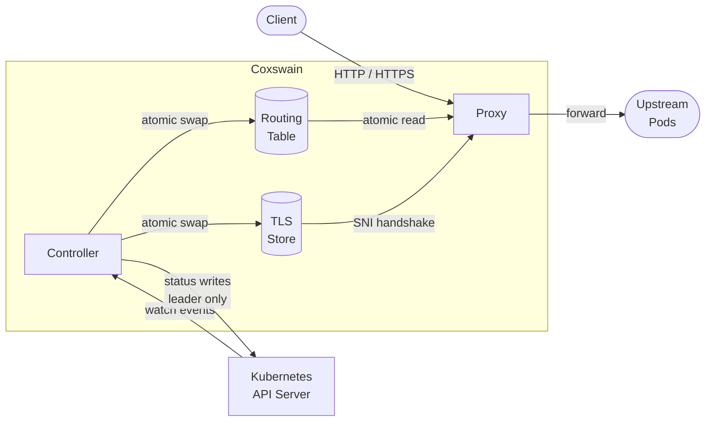
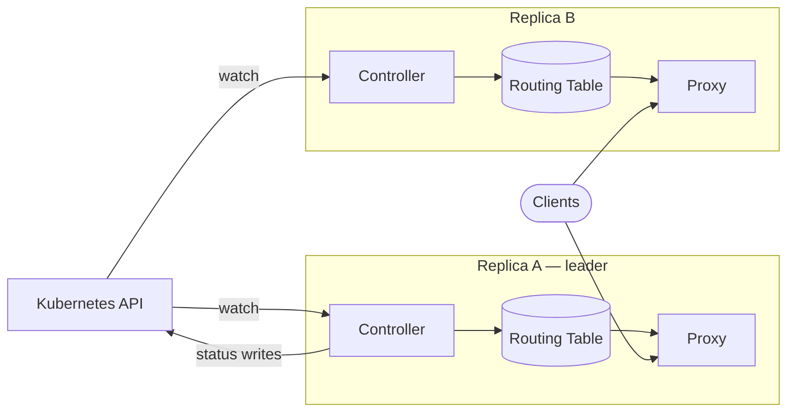
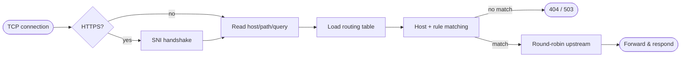

# Architecture

## Overview

The controller watches Kubernetes objects and maintains the routing and TLS tables. The proxy reads from those tables on every request via a single atomic load — no locks, no channels. Routing and TLS updates take effect on the next request after the swap, with no restart and no dropped connections.

## Multi-replica and leader election

All replicas reconcile watch events and maintain their own routing table independently. They all serve traffic all the time. What leader election controls is narrower: only **status writes** (the conditions written back to `Ingress`, `Gateway`, and `HTTPRoute` objects).

The leader is determined by a Kubernetes `Lease` in `coxswain-system`. When the leader is lost, status writes pause for up to one lease TTL (default 15 s) while the new leader is elected. Traffic continues uninterrupted on all replicas during the transition.

## TLS hot-reload

Coxswain watches all `kubernetes.io/tls` Secrets. When a Secret is created, updated, or deleted — including automatic renewals by cert-manager — the TLS store is rebuilt and swapped atomically. New connections immediately use the new certificate; connections already in progress complete with the old one. No restart is required.

## Request path

## Readiness

`/readyz` returns 200 only after every subsystem has reported ready. During startup this means: all Kubernetes reflectors have completed their initial list (CRDs must be installed and RBAC must be correct), and the routing table has been built at least once. `/readyz` returning 503 on a running pod is a signal that something is wrong — inspect `/status` to see which subsystem is blocked.
