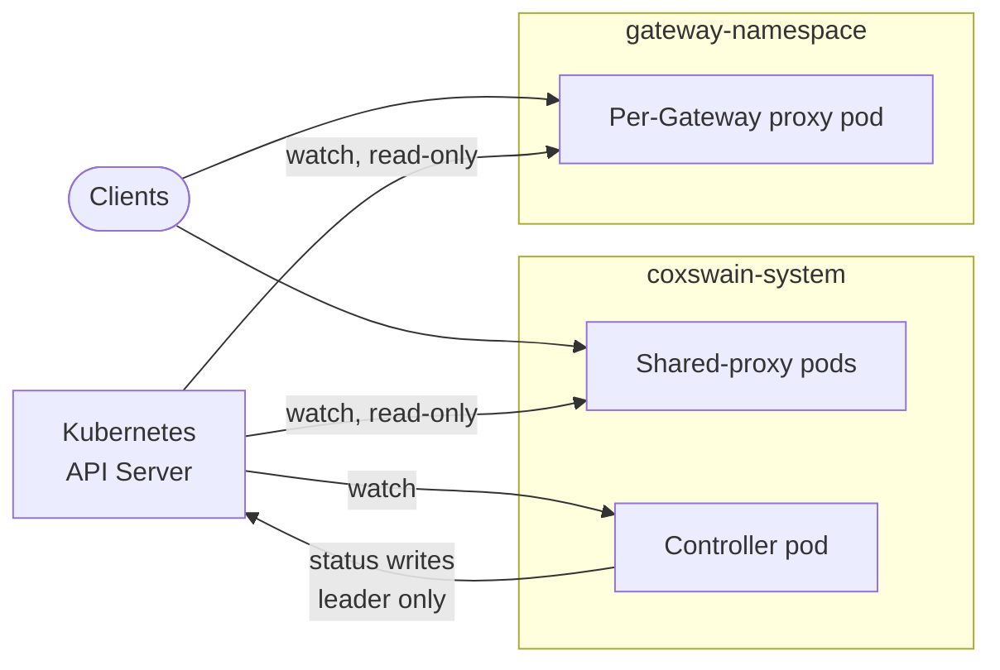
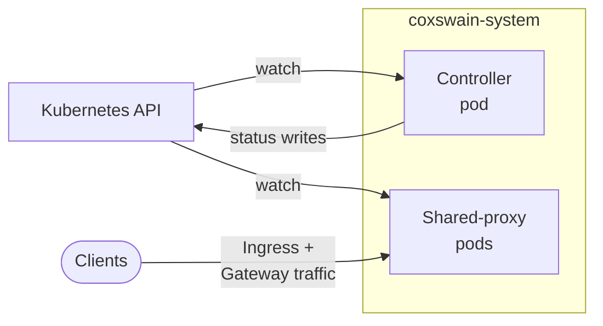
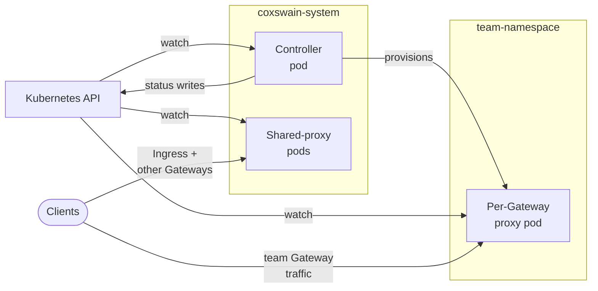
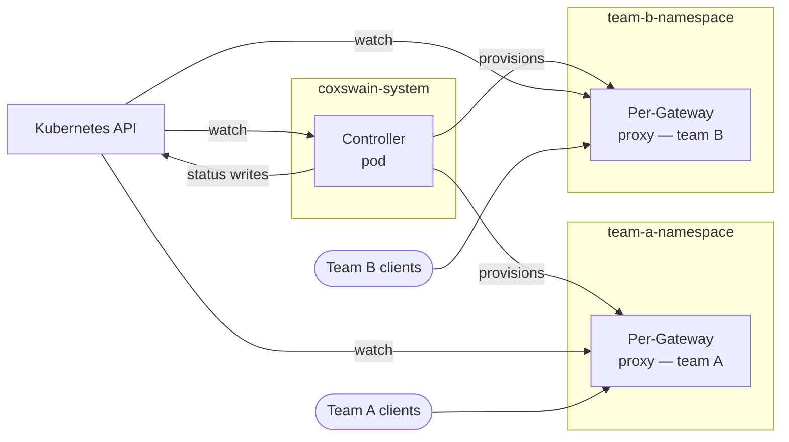
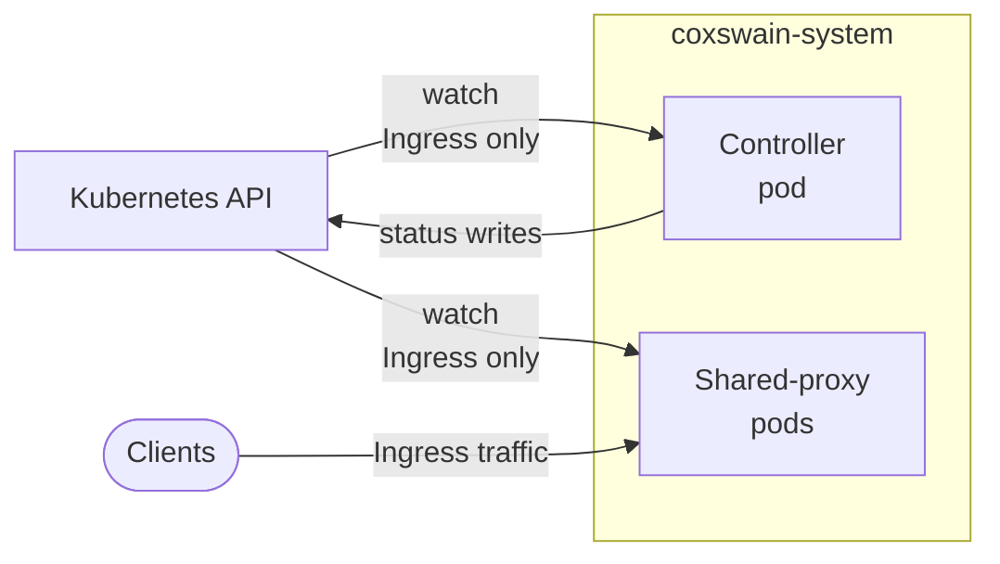

# Architecture

Coxswain runs as one or more pods, each invoked with a `serve <role>` subcommand. The controller is the sole Kubernetes writer; proxies are read-only data planes that build their routing table directly from Kubernetes watch events and scale horizontally with no coordination.

## Roles

### `serve controller`

Watches Ingress, GatewayClass, Gateway, HTTPRoute, and related resources cluster-wide; writes status conditions back to them; provisions per-Gateway proxy `Deployment` and `Service` objects when a Gateway opts into dedicated mode. Leader-elected via a Kubernetes `Lease` in `coxswain-system` — status writes pause for up to one Lease TTL during a leader transition; traffic is unaffected. Scales vertically (one active replica + optional warm standby).

The provisioning operator runs as a kube-rs `Controller` alongside the status writer in the same pod. Its reconcile loop resolves each Gateway's effective `CoxswainGatewayParameters` (per-field overlay: Gateway's `parametersRef` wins per-field, GatewayClass's fills the rest; `podTemplate` strategic-merges across both layers) and renders the desired `Deployment` / `Service` / `ServiceAccount`. The `podTemplate` escape hatch is merged onto the rendered Deployment with `kubectl apply` strategic-merge semantics — `containers` merges by `name`, `tolerations` by `(key, operator)`, container-level `env` by `name`, and so on — so sidecar injection and env overlays behave the way operators expect from native K8s tooling.

As of issue #207 the operator runs in *log-only* mode: it hashes the rendered specs and logs the YAML at `INFO` whenever they change. No cluster writes happen — the controller's RBAC at this stage carries `get/list/watch` on `CoxswainGatewayParameters` but no create/update on `Deployment` / `Service` / `ServiceAccount`. Step 9 (#208) promotes the operator to server-side-apply and adds the matching RBAC.

### `serve proxy --shared`

Stateless read-only Pingora data plane. Serves every `Ingress` and every `Gateway` not opted into dedicated mode. Scales horizontally with no leader election and no inter-replica coordination.

### `serve proxy --dedicated`

Read-only proxy scoped to a single Gateway (identified by `--gateway-name` and `--gateway-namespace`). Provisioned by the controller in the Gateway's namespace (or a namespace specified via `parametersRef`) — see Step 9 of the architecture plan. Has its own rollout, failure domain, and `/metrics`. As of issue #206 (v0.2), the dedicated proxy runs with the same cluster-wide-reads RBAC profile as the shared proxy; per-namespace read narrowing is paired with Step 10's per-Gateway-proxy `RoleBinding` reconciliation.

When the target Gateway has any listener with `allowedRoutes.namespaces.from: All` or `Selector`, the operator must explicitly opt in to broader RBAC via `--allow-cluster-wide-route-read` (for `from: All`) or `--allow-cluster-wide-namespace-read` (for `from: Selector`). Today these flags govern a startup warning only; once Step 10 lands, listeners using a non-`Same` `from` without the matching opt-in will be marked `Accepted=false`.

### `serve dev`

Hidden single-process all-in-one combining controller and proxy in one binary, for local development and conformance against `kind` / OrbStack.

!!! warning "Never rendered by Helm"
    Dev mode is a contributor convenience; do not run it in production.

## Deployment models

### Default (split shared pool)

The Helm chart default. One controller `Deployment` and one shared-proxy `Deployment` in `coxswain-system`.

### Mixed

The default layout plus per-Gateway proxy pods in user namespaces. Workload teams opt a `Gateway` into dedicated mode via `parametersRef`; the controller provisions the per-Gateway pod automatically.

### Strict multi-tenant

Every Gateway gets its own proxy pod; the shared-proxy `Deployment` runs at `replicas: 0`. Classic `Ingress` is unavailable in this model.

### Ingress-only

For clusters without Gateway API CRDs. The controller detects their absence at startup and skips Gateway API reconciliation; the shared-proxy pool serves all `Ingress` resources.

## State transport

Each proxy pod self-watches Kubernetes directly:

- A **shared-proxy** uses a broad cluster-wide filter covering all routing CRs (HTTPRoute, Ingress, Gateway, Service, EndpointSlice).
- A **dedicated proxy** (`--dedicated`) narrows its routing-table build to a single named Gateway; cross-namespace backends and TLS Secrets resolve via `ReferenceGrant` as usual. Per-namespace watch narrowing (and the matching RBAC narrowing) is paired with Step 10 of the architecture plan; until then the dedicated proxy uses cluster-wide reads with zero write verbs, identical to the shared-proxy RBAC profile.

There is no xDS server and no IPC between the controller and any proxy — the controller never pushes data, and a controller crash never disrupts proxy traffic. A future `--source=xds` mode could be added behind the same `RoutingSource` trait boundary without touching proxy code.

## RBAC by mode

| Resource | Verb | `controller` | `shared-proxy` | `dedicated-proxy` |
|---|---|:-:|:-:|:-:|
| HTTPRoute, Gateway, GatewayClass, Ingress, IngressClass | list, watch, get | ✓ (cluster) | ✓ (cluster) | ✓ (cluster today; namespace after Step 10) |
| Service, EndpointSlice | list, watch, get | ✓ (cluster) | ✓ (cluster) | ✓ (cluster today; namespace after Step 10) |
| Secret (`kubernetes.io/tls`) | list, watch, get | ✓ (cluster) | ✓ (cluster) | ✓ (cluster today; namespace after Step 10) |
| HTTPRoute, Gateway, Ingress `/status` | update, patch | ✓ (cluster) | — | — |
| Deployment, Service | create, update, delete | ✓ (scoped) | — | — |
| Lease | create, update, get | ✓ (`coxswain-system`) | — | — |

## Admin endpoints by mode

| Endpoint | Controller | Shared-proxy | Dedicated-proxy |
|---|:-:|:-:|:-:|
| `/healthz`, `/readyz` | ✓ | ✓ | ✓ |
| `/metrics` | ✓ (reconcile counts, leader status) | ✓ (traffic, errors) | ✓ (scoped to this Gateway) |
| `/status` | ✓ (subsystems + counters) | ✓ | ✓ |
| `/routes` | — | ✓ | ✓ |
| `/cluster` | ✓ (all Gateways/Ingresses aggregate) | — | — |

## Request path

The routing table is an immutable snapshot behind an atomic pointer; each request reads it with a single atomic load — no locks, no channels. Reconciles build a new snapshot and swap the pointer atomically; the next request sees the new routing, in-flight requests are unaffected.

TLS works the same way: the TLS store is an atomic snapshot rebuilt on every `kubernetes.io/tls` Secret change. New connections use the new certificate; connections in progress complete with the old one.
