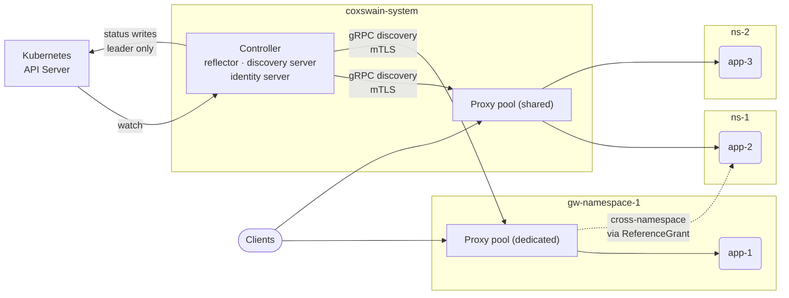
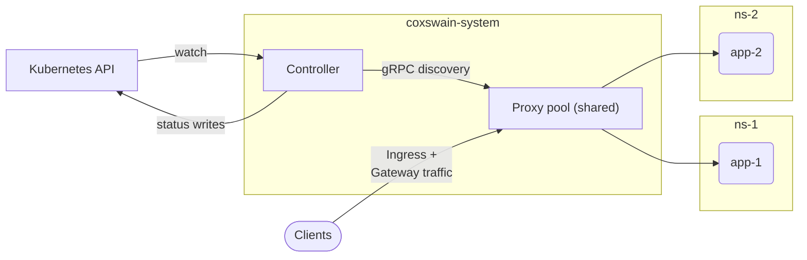
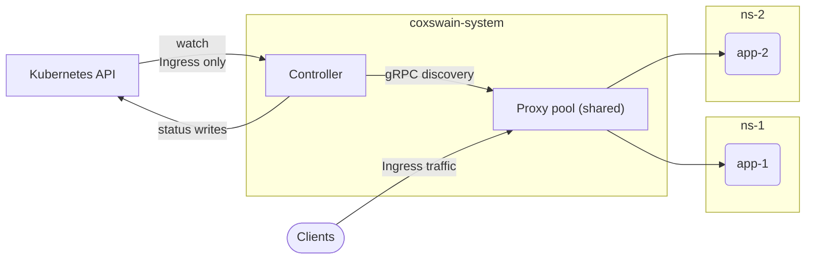
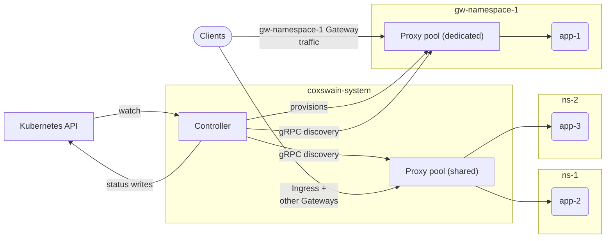
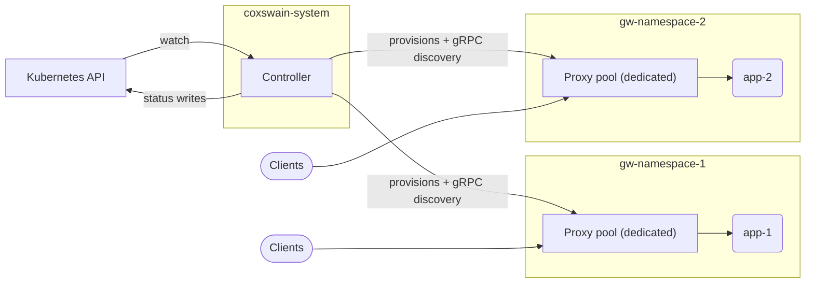
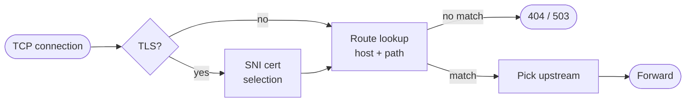

# Architecture

Coxswain runs as one or more pods, each invoked with a `serve <role>` subcommand. The controller is the sole Kubernetes reader and writer; proxies are read-only data planes that receive compiled routing snapshots from the controller over a mandatory-mTLS gRPC discovery stream and hold zero Kubernetes API credentials.

## Roles

### `serve controller`

Watches Ingress, GatewayClass, Gateway, HTTPRoute, and related resources cluster-wide; writes status conditions back to them; provisions per-Gateway proxy `Deployment`, `Service`, and `ServiceAccount` objects when a Gateway opts into dedicated mode. Leader-elected via a Kubernetes `Lease` in `coxswain-system` — status writes pause for up to one Lease TTL during a leader transition; traffic is unaffected. Scales vertically (one active replica + optional warm standby).

The controller also runs two gRPC listeners that proxies connect to:

- **Discovery (Stream) listener** (port 50051, mTLS mandatory): compiles routing snapshots from K8s resources and pushes them to subscribed proxies. Each snapshot is scoped to the subscriber's declared `Scope` — see [Scope-aware dispatch](#scope-aware-dispatch) below.
- **Bootstrap (Identity) listener** (port 50052, server-auth-only TLS): acts as a certificate authority. A fresh proxy presents its ServiceAccount token and a CSR; the controller validates the token via `TokenReview`, signs a short-lived SPIFFE SVID, and returns it. See [Control-plane security](guides/control-plane-security.md).

The provisioning operator runs as a kube-rs `Controller` alongside the status writer in the same pod. Its reconcile loop resolves each Gateway's effective `CoxswainGatewayParameters` (per-field overlay: Gateway's `parametersRef` wins per-field, GatewayClass's fills the rest; `podTemplate` strategic-merges across both layers) and renders the desired `Deployment` / `Service` / `ServiceAccount`. The `podTemplate` escape hatch is merged onto the rendered Deployment with `kubectl apply` strategic-merge semantics — `containers` merges by `name`, `tolerations` by `(key, operator)`, container-level `env` by `name`, and so on — so sidecar injection and env overlays behave the way operators expect from native K8s tooling.

The controller also watches `IngressClass` and its associated `CoxswainIngressClassParameters` objects (the `IngressClass.spec.parameters` reference target). These carry class-level defaults for Ingress routes: `spec.defaultAnnotations` (per-key annotation defaults that per-Ingress annotations can override) and `spec.accessLog` (per-class access-log suppression).

### `serve proxy --shared`

Read-only Pingora data plane. Subscribes to the controller discovery stream with `Scope::SharedPool` and receives a compiled snapshot covering every `Ingress` and every `Gateway` not opted into dedicated mode. Scales horizontally with no leader election and no inter-replica coordination.

Required args: `--discovery-endpoint` (comma-separated controller Stream endpoint(s), `https://` for mTLS). On first start the proxy bootstraps an SVID via `--discovery-bootstrap-endpoint` and then opens the mTLS stream. Routing tables are never cleared across reconnects.

The shared proxy holds **zero Kubernetes API credentials**. Its ServiceAccount exists only as a pod identity; the only token mounted is an audience-scoped projected SA token (`coxswain-discovery` audience) used exclusively for SVID bootstrap. No ClusterRole or RoleBinding is bound to it.

### `serve proxy --dedicated`

Read-only proxy scoped to a single Gateway (identified by `--dedicated --gateway-name=NAME --gateway-namespace=NS`). Provisioned by the controller in the Gateway's own namespace. Has its own rollout, failure domain, and `/metrics`.

The dedicated proxy subscribes with `Scope::Gateway { name, namespace }` and receives only its Gateway's routing snapshot. The controller stamps the expected proxy ServiceAccount name (`{gateway-name}-{gatewayclass-name}`, per GEP-1762) into the Gateway's registry entry at reconcile time. When the subscription arrives, the discovery server verifies that the peer's mTLS SVID matches that expected SA before sending any snapshot — a mismatch yields `PERMISSION_DENIED`.

Like the shared proxy, the dedicated proxy holds **zero Kubernetes API credentials**. Cross-namespace route attachment (`allowedRoutes.namespaces.from: All`/`Selector`) is resolved by the controller at reconcile time — the controller's cluster-wide reflector compiles all cross-namespace routes into the per-Gateway snapshot before it is pushed. No proxy-side cluster-wide reflector and no proxy-side RBAC are required.

### `serve dev`

Hidden single-process all-in-one combining controller and proxy in one binary, for local development and conformance against `kind` / OrbStack. The proxy pipeline reads routing snapshots from the in-process `Shared` handoff — no discovery gRPC wire, no `--discovery-endpoint` needed.

!!! warning "Never rendered by Helm"
    Dev mode is a contributor convenience; do not run it in production.

### `serve relay` (v0.6, not yet implemented)

Designed as a recursive discovery node — a relay that subscribes to an upstream discovery stream and re-publishes snapshots to downstream proxies across a network boundary. Deferred to v0.6.

## Scope-aware dispatch

The controller maintains two snapshot registries:

- **`SharedPool`** — five shared routing cells (Ingress table, Gateway table, TLS store, client-cert store, listener health). The shared proxy pool subscribes with this scope and receives a snapshot covering all Ingress and non-dedicated Gateway routing.
- **`Gateway { name, namespace }`** — one entry per opted-in Gateway in the `DedicatedRoutingRegistry`. Each dedicated proxy subscribes with its own Gateway identity and receives only that Gateway's slice. Cross-namespace routes (e.g. `from: All`) are resolved controller-side — the controller's cluster-wide reflector sees every namespace's routes and compiles them into the per-Gateway snapshot before pushing.

A `Subscribe` message with no scope field is treated as `SharedPool`. A scope message with no kind discriminator is rejected as malformed to prevent a zero-value proto from silently escalating to `SharedPool`.

## Deployment models

Coxswain has two macro deployment models: **Shared** and **Dedicated**. They are not mutually exclusive — a production cluster typically runs a shared proxy pool alongside one or more dedicated proxies for Gateways that need isolation.

### Shared

One cluster-wide proxy pool serves every `Ingress` and every `Gateway` that has not opted into dedicated mode. This is the Helm chart default: one controller `Deployment` and one shared proxy `Deployment` in `coxswain-system`.

**Ingress-only (runtime variant):** when Gateway API CRDs are absent at startup, the controller detects their absence, skips Gateway API reconciliation, and the shared proxy pool serves all `Ingress` resources.

### Dedicated (per Gateway)

When a `Gateway` carries a `parametersRef` pointing at a `CoxswainGatewayParameters` object (either on the Gateway directly or inherited from its `GatewayClass`'s `spec.parametersRef`), the controller provisions a dedicated proxy — its own `Deployment`, `Service`, and `ServiceAccount` — in the Gateway's namespace. Traffic for that Gateway is served exclusively by its dedicated proxy pool; the shared proxy pool continues to serve everything else.

A cluster running some dedicated Gateways alongside the shared pool is the typical mixed arrangement:

When every Gateway opts into dedicated mode and the shared proxy `Deployment` is scaled to `replicas: 0`, each team's Gateway gets a fully isolated data plane. Classic `Ingress` is unavailable in this arrangement.

## Discovery control plane

The controller compiles K8s routing snapshots and pushes them to each subscribed proxy over a mandatory-mTLS gRPC stream. Proxies apply the snapshot to their in-process routing table via an atomic pointer swap — no locks, no channels, no restart. All routing data (routes, upstream addresses, TLS certificates) arrives via the discovery stream; the proxy never reads the Kubernetes API.

### Reconnect semantics

The discovery client runs a jittered-exponential-backoff reconnect supervisor (250 ms → 30 s):

- **Before first snapshot** — `/readyz` returns 503 (`NotReady`). The proxy starts serving only after the first snapshot arrives.
- **On disconnect after first snapshot** — the proxy transitions to `Degraded` (not `NotReady`). The last-good snapshot is served indefinitely; traffic never gaps and routing tables are never cleared during a reconnect window.
- **On reconnect + new snapshot** — the proxy returns to `Ready`.
- **Controller down** — the proxy keeps serving its last-good snapshot. No data-plane impact.

### Wire-version skew

`WIRE_VERSION = 1` (current). The server rejects any client that presents a different version with `FAILED_PRECONDITION`; the client backs off permanently on that status. Recovery: roll back the mismatched component (controller or proxy) to a matching version. See [Control-plane security](guides/control-plane-security.md) for the full protocol description.

## RBAC by mode

| Resource | Verb | `controller` | `shared-proxy` | `dedicated-proxy` |
|---|---|:-:|:-:|:-:|
| HTTPRoute, Gateway, ReferenceGrant, BackendTLSPolicy | list, watch, get | ✓ (cluster) | — | — |
| GatewayClass, Ingress, IngressClass | list, watch, get | ✓ (cluster) | — | — |
| Service, EndpointSlice | list, watch, get | ✓ (cluster) | — | — |
| Secret (`kubernetes.io/tls`), ConfigMap | list, watch, get | ✓ (cluster) | — | — |
| HTTPRoute, Gateway, Ingress `/status` | update, patch | ✓ (cluster) | — | — |
| Gateway | patch | ✓ (cluster — finalizers only) | — | — |
| Deployment, Service, ServiceAccount | create, update, delete | ✓ (cluster) | — | — |
| Lease | get, create, patch | ✓ (`coxswain-system`) | — | — |
| TokenReview | create | ✓ (cluster — SVID bootstrap) | — | — |

Both proxy roles hold **zero Kubernetes API credentials**. All routing data arrives via the controller's gRPC discovery stream. Each proxy mounts only a projected ServiceAccount token (audience `coxswain-discovery`) for SVID bootstrap at `/var/run/secrets/coxswain/discovery-token/token` — this is mounted by the kubelet, not via RBAC — and the public trust-bundle ConfigMap at `/var/run/secrets/coxswain/trust-bundle/ca.crt`. Neither mount requires any K8s RBAC grant.

## Admin endpoints by mode

| Endpoint | Controller | Shared-proxy | Dedicated-proxy |
|---|:-:|:-:|:-:|
| `/healthz`, `/readyz` | ✓ | ✓ | ✓ |
| `/metrics` | ✓ (reconcile counts, leader status) | ✓ (traffic, errors) | ✓ (scoped to this Gateway) |
| `/api/v1/health` | ✓ (subsystem detail, version, leader) | ✓ | ✓ |
| `/api/v1/routes` | — | ✓ | ✓ |
| `GET /` (operator UI) + `/api/v1/{fleet,routing}/*` | ✓ (cluster-wide aggregate + summaries) | — | — |
| `/api/v1/{problems,events,manifests/*,pods/*/logs}` | ✓ | — | — |

## Request path

The routing table is an immutable snapshot behind an atomic pointer; each request reads it with a single atomic load — no locks, no channels. The discovery supervisor builds a new snapshot from the wire DTO and swaps the pointer atomically; in-flight requests complete against the old snapshot, the next request sees the new routing.

TLS works the same way: the TLS store is an atomic snapshot rebuilt on every push. New connections use the new certificate; connections in progress complete with the old one.
