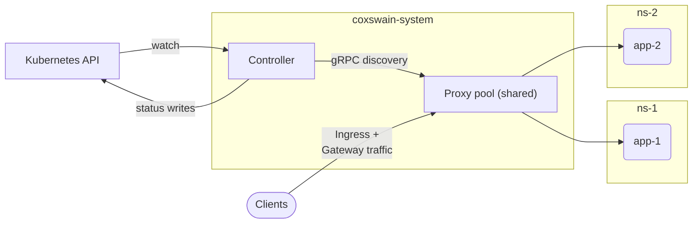
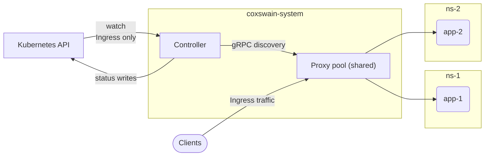
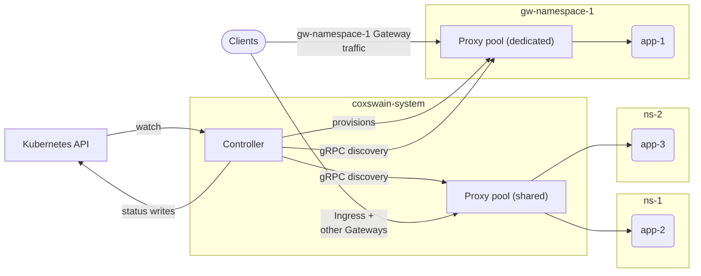
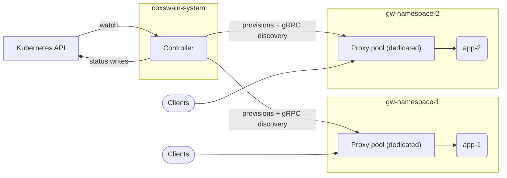

# Deployment models

Coxswain has two macro deployment models: **Shared** and **Dedicated**. They are not mutually exclusive — a production cluster typically runs a shared proxy pool alongside one or more dedicated proxies for Gateways that need isolation.

## Scope-aware dispatch

Before the two models: both rely on the controller sending each proxy only the routing slice it needs, not the whole cluster's. The controller maintains two snapshot registries for this:

- **`SharedPool`** — the shared routing cells (Ingress table, Gateway table, TLS store, client-cert store, listener health, plus the TLS-passthrough/terminate and TCP/UDP L4 tables). The shared proxy pool subscribes with this scope and receives a snapshot covering all Ingress and non-dedicated Gateway routing.
- **`Gateway { name, namespace }`** — one entry per opted-in Gateway in the `DedicatedRoutingRegistry`. Each dedicated proxy subscribes with its own Gateway identity and receives only that Gateway's slice. Cross-namespace routes (e.g. `from: All`) are resolved controller-side — the controller's cluster-wide reflector sees every namespace's routes and compiles them into the dedicated snapshot before pushing.

A `Subscribe` message with no scope field is treated as `SharedPool`. A scope message with no kind discriminator is rejected as malformed to prevent a zero-value proto from silently escalating to `SharedPool`.

## Shared

One cluster-wide proxy pool serves every `Ingress` and every `Gateway` that has not opted into dedicated mode. This is the Helm chart default: one controller `Deployment` and one shared proxy `Deployment` in `coxswain-system`.

**Shared compute, per-Gateway addressing.** "Shared" describes the proxy *pod* (one set of compute serving everything) — it does not mean Gateways share an address. Each owned `Gateway` still gets its own `Service`/VIP:

- The controller provisions one `Service` per Gateway. That `Service` selects the (single, shared) proxy pod, but maps each of the Gateway's advertised listener ports (e.g. `:443`) to its own distinct internal `targetPort` on that pod.
- The proxy uses the local port a connection arrived on to decide which Gateway's routing/TLS tables apply. That's what keeps two Gateways with overlapping hostnames (both listening on `*.example.com`, say) fully isolated from each other — they're distinguished by port, not just by name.
- Each Gateway still reports its own VIP in `status.addresses`, same as if it had its own dedicated proxy.
- This only relies on standard Kubernetes `Service` `port → targetPort` mapping — no `SO_ORIGINAL_DST`, no conntrack tricks — so it works the same on iptables, IPVS, eBPF, and cloud load balancers alike.

**Per-Gateway infrastructure identity (GEP-1867).** The shared pool's actual compute lives in `coxswain-system`, but each Gateway still needs its own "infrastructure identity" per the Gateway API spec — so the controller also provisions a `ServiceAccount` for each owned Gateway, in that Gateway's *own* namespace. This SA is deliberately inert:

- It carries **zero RBAC** — the proxy pod itself runs under a different ServiceAccount entirely. This one exists purely as an identity object.
- Its job is to be the carrier for `spec.infrastructure.{labels,annotations}` (the GEP-1867 metadata a Gateway can request be applied to its infrastructure) — since in the shared model there's no per-Gateway proxy pod in that namespace for those labels/annotations to land on otherwise.
- It's owner-referenced to the Gateway, so deleting the Gateway garbage-collects it automatically; moving a Gateway into dedicated mode prunes it explicitly instead.
- Infrastructure annotations from this object also propagate onto the Gateway's VIP `Service` — this is how, for example, a cloud load-balancer annotation set on the Gateway reaches the actual `LoadBalancer` Service.

The fixed shared `80`/`443` listeners on the proxy pod are **Ingress-only**: Ingresses legitimately share one address because they merge by host/path and have no per-Ingress isolation. The cost of per-Gateway addressing is **one load-balancer IP per Gateway** in cloud environments — the "one IP for everything" property is intentionally given up; only the proxy compute stays shared. The shared-proxy selector the controller stamps on each VIP `Service` is supplied by the Helm chart via `--shared-proxy-selector` (the chart knows the release name; the controller cannot derive `app.kubernetes.io/instance` itself).

The VIP `Service` type is set by `proxy.shared.vipServiceType` (default `LoadBalancer`), independent of the shared-proxy `Service` itself. `LoadBalancer` gives each Gateway an external address and works on cloud LBs and MetalLB, which assign a distinct IP per `Service` and route `IP:port` independently. It does **not** work on host-port-binding LBs such as k3s/OrbStack `klipper-lb`, where multiple `LoadBalancer` Services advertising the same port (e.g. `:443`) collide on the host and stay `<pending>` — set `vipServiceType: ClusterIP` there to give each Gateway a stable in-cluster VIP (typically fronted by an external ingress/LB). `NodePort` is rejected: it cannot preserve the advertised listener port.

**Ingress-only (runtime variant):** when Gateway API CRDs are absent at startup, the controller detects their absence, skips Gateway API reconciliation, and the shared proxy pool serves all `Ingress` resources.

## Dedicated (per Gateway)

When a `Gateway` carries a `parametersRef` pointing at a `CoxswainGatewayParameters` object (either on the Gateway directly or inherited from its `GatewayClass`'s `spec.parametersRef`), the controller provisions a dedicated proxy — its own `Deployment`, `Service`, and `ServiceAccount` — in the Gateway's namespace. Traffic for that Gateway is served exclusively by its dedicated proxy pool; the shared proxy pool continues to serve everything else.

A cluster running some dedicated Gateways alongside the shared pool is the typical mixed arrangement:

When every Gateway opts into dedicated mode and the shared proxy `Deployment` is scaled to `replicas: 0`, each team's Gateway gets a fully isolated data plane. Classic `Ingress` is unavailable in this arrangement.

See [Dedicated proxy pools](../guides/dedicated-mode.md) for the operator-facing walkthrough — opting a Gateway in, tunable fields, and RBAC.

## Discovery relay tier

The relay tier is **not** a third deployment model — it is optional *discovery infrastructure* that sits between the controller and the proxies to scale leader fan-out. It changes nothing about how proxies serve traffic; it only changes where they get their routing snapshots from.

**The problem it solves.** Every snapshot stream terminates on the leader controller pod (the discovery `Service` selects the leader). Fan-out, per-stream delta computation, and push bandwidth all scale O(nodes) — shared replicas + dedicated Gateways × replicas — on that one pod. A relay is a zero-RBAC cache pod that subscribes *once* upstream and re-serves the **unchanged** protocol downstream, so the leader sees one stream per relay instead of one per proxy. Leaves run unmodified binaries with unmodified scopes — only their discovery endpoint and expected-server identity differ, and they never learn they are behind a relay.

Two families, split along the same static-vs-dynamic line as the proxies themselves:

- **Shared-pool relay** — a single, install-level relay in front of the shared proxy pool. It subscribes `SharedPool` and re-serves it verbatim (a flat passthrough cache). Because the shared pool is static Helm-managed infrastructure, so is its relay: you enable it in Helm (`relay.shared.enabled`), which both renders the relay and repoints the shared proxies at it. It can autoscale (`relay.shared.autoscaling`) because it fronts the whole, cluster-wide pool.
- **Namespace relay** — a per-namespace relay in front of a namespace's *dedicated* proxies. It subscribes the aggregate `Namespace` scope (every dedicated Gateway's world in that namespace, key-qualified per Gateway), demuxes it back into per-Gateway worlds, and serves each dedicated proxy exactly as the controller would. Because dedicated proxies are dynamic and controller-provisioned, so are their relays: the **controller** provisions a namespace relay (and repoints that namespace's dedicated proxies) — nothing to hand-manage. Enable with `relay.dedicated.enabled`.

**When a namespace relay appears (break-even + scale-to-zero).** A relay costs the leader `relay.dedicated.replicas` streams (each replica opens its own upstream stream) and saves it the namespace's downstream streams. So it only *reduces* leader load once a namespace's desired dedicated-proxy replicas exceed the relay's own cost. The controller provisions a namespace relay only when that count reaches `relay.dedicated.minProxyReplicas` (default 8); below it the namespace stays direct-to-controller — a small namespace is never handed a relay it doesn't need. Once provisioned, a relay is kept until its namespace drains to **zero** dedicated Gateways (hysteresis), so a transient dip never strands the sibling proxies still pointed at it.

**Authorization.** The shared relay's `SharedPool` subscribe needs no grant. A namespace relay's `Namespace` subscribe is privileged (it aggregates a whole namespace), so the controller authorizes it **by provenance**: only the relay ServiceAccount it provisioned in that namespace, deny-by-default. A projected token cryptographically binds a pod's SVID to its own namespace, so the worst a forged label can buy is a stream for the tenant's *own* namespace — never a peer's.

**Failure model.** Bootstrap is never tiered — every node, relays included, obtains its SVID straight from the controller. On relay loss a leaf serves its last-good snapshot and reconnects; there is no cross-tier fallback (a leaf never dials the controller when its relay is down). Relay HA is its replica count.

**Per-namespace tuning (`CoxswainRelayPolicy`).** The break-even rule above is the *automatic default* — turning the tier on already provisions relays where they reduce leader load, with no per-namespace action. The cluster-scoped [`CoxswainRelayPolicy`](../reference/relay-policy.md) CRD overlays per-namespace **overrides and tuning** on top: `enabled` force-on/off (bypassing or vetoing the threshold), `replicas`, full `resources`, `podTemplate` scheduling (nodeSelector / tolerations / affinity / topologySpreadConstraints / priorityClassName), and opt-in autoscaling. It applies **only** to the controller-provisioned namespace relays — the shared-pool relay is static Helm-managed infra tuned entirely through `relay.shared.*` values, never this CRD.

Namespace-relay autoscaling is **controller-driven, not an HPA**. The relay is I/O/fan-out-bound (CPU mistracks its load) and each replica opens its own upstream stream to the leader, so the controller sizes the relay directly from the namespace's dedicated-proxy fan-out — `clamp(ceil(fanout / targetProxiesPerReplica), minReplicas, maxReplicas)` — with **`maxReplicas` mandatory** as the cap on that fan-out regrowth (an uncapped autoscaling stanza is ignored). Keep `maxReplicas` well below the namespace's downstream fan-out, or the relay's own upstream streams approach the count it is meant to collapse. A connection-count custom-metric HPA would track load even more precisely but requires a cluster metrics adapter; it is a possible future refinement, deliberately not the default.

The whole tier is **off by default** — a relay-free install is byte-identical to one without the feature.
