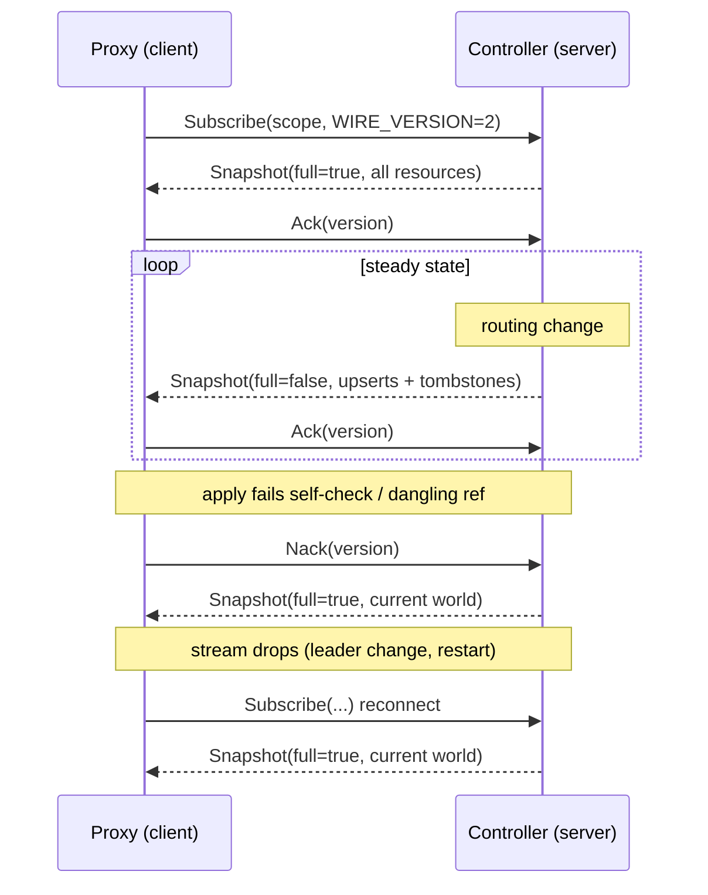

# Discovery protocol

The controller compiles K8s routing state and pushes it to each subscribed proxy over a mandatory-mTLS gRPC stream. The wire is **resource-oriented** (`WIRE_VERSION = 2`): the first message of a session is a full snapshot, and every change after it is a per-resource delta — only what moved. Proxies apply each message to their in-process routing tables via atomic pointer swaps, recompiling only the partitions that changed — no locks, no channels, no restart. All routing data (routes, upstream addresses, TLS certificates) arrives via the discovery stream; the proxy never reads the Kubernetes API.

!!! note "Securing the channel"
    This page covers the protocol's data-flow and status-gating logic. For how the channel is authenticated (mTLS, SPIFFE SVIDs, CA provisioning modes), reconnect behaviour, and wire-version compatibility, see [Control-plane security](../operations/control-plane-security.md).

## The wire protocol

Each subscriber gets one full snapshot, then a stream of deltas. The server keeps a per-stream baseline — the set of resources that stream last acknowledged — and every subsequent message is a diff against it: resources whose content changed ride as **upserts**, resources that left the world ride as **tombstones**. Nothing else is re-sent.

Three things always produce a **full** snapshot; everything else is a delta:

- **First subscribe** — the client has no baseline yet.
- **Reconnect** — per-stream baseline is not portable across streams, so a redial re-syncs from scratch.
- **Nack** — if a client cannot apply a message (see the invariants below), it Nacks; the server answers with a fresh full of the current world. This is the protocol's self-healing path: a client can always recover a consistent world without operator action.

One message is in flight at a time (send-after-Ack). Rebuilds that arrive while a message is un-Acked are coalesced — after the Ack the server sends a single delta spanning the acked baseline to the latest world.

### The resource model

The old wire sent a fixed set of whole tables and re-serialized every one of them on every change. The v2 wire is a flat set of independently-addressed **resources**, each with a canonical key and a content hash. A change to one route touches one resource; the rest of the world stays byte-identical on the wire and is never re-sent.

Canonical keys are `|`-separated and name exactly one resource:

- `route|<ingress|gateway>|<port>|<match-kind>[|<host>]` &mdash; one host bucket of an L7 route table.
- `tls|<port>` and `clientcert|<port>` &mdash; per-port TLS material and client-cert config.
- `tlspassthrough|<port>`, `tlsterminate|<port>`, `tcp|<port>`, `udp|<port>` &mdash; per-port L4 routes.
- `listener|<ns>/<name>` &mdash; one Gateway's listener status.
- `endpoints|<ns>/<svc>/<port>` &mdash; one EDS endpoint set (see below).

The full grammar lives in exactly one place in the code (`wire/resource.rs`), so the server (which addresses its per-stream baseline by key) and the client (which keys its resource cache by key) cannot drift.

### EDS-style endpoints, and why

Upstream endpoints are their own resource, keyed `(namespace, service, port)`, and a route's weighted backend carries an **`endpoint_ref`** to one instead of inlining pod IPs. This is the change that makes deltas pay off.

Under the old wire, a rolling deploy — pods coming and going — rewrote every route that referenced the churning Service, because the endpoint IPs were baked into the route. Each rewrite changed the route's hash, so the whole route re-serialized and the client recompiled it. With endpoints split out, a rolling deploy ships **one** `endpoints|…` delta; routes that reference it are untouched on the wire, and the client recompiles only the partitions that actually point at that Service.

Endpoint-derived status is computed **client-side** from the same shared rule the controller would have used: a referenced Service that does not exist yields `500`, and one that exists but has zero ready endpoints yields `503`. Because that status is derived from the endpoint resource rather than baked into the route, draining a backend to zero is again a single endpoint delta — it does not rewrite or re-send the route. Endpoint-independent statuses (fail-closed `502` variants, `500` for a route with no usable backends at all) stay baked on the route where they belong.

### Invariants a client can rely on

1. **Atomic apply.** A message applies in full or not at all. The client stages every change off to the side, runs all its checks, and only then swaps the live routing cells — so a malformed or inconsistent message never partially lands.
2. **Last-good on failure.** If any check fails, the client keeps serving its previous world unchanged and Nacks. Traffic never drops on a bad push.
3. **Self-healing.** A Nack is answered with a fresh full snapshot, so a client that falls out of sync — for any reason — is pulled back to a consistent world without operator intervention.
4. **Referential integrity.** After any message, every `endpoint_ref` a route reaches resolves to an endpoint resource the client holds. The server ships a newly-referenced endpoint set in the same message that first references it, and tombstones one in the same message its last referrer leaves.
5. **Emptiness travels as removal** — with one deliberate exception: an endpoint resource that exists with zero addresses is meaningful (it is the `503` "valid but empty" signal), so it is sent, not tombstoned.
6. **Version self-check.** Each message carries a global `version` — an order-independent hash of the per-resource hashes of the post-apply world. The client recomputes it from what it just staged and refuses to commit on a mismatch (Nack → full resync). This is the same content-hash formula the old whole-table wire used, so the convergence machinery below is unchanged.

### Convergence

The global `version` is a content hash of the whole post-apply world, identical in meaning to the pre-v2 version. `Programmed` gating (below), the `NodeRegistry`, and the ack-tracking that tells the leader whether a proxy has caught up to a given generation all key off it exactly as before — the delta rework changed *how* a world is transmitted, not how convergence to a world is measured.

### Observing the stream

The `coxswain_discovery_*` series expose the delta engine on both ends — server-side on the controller `/metrics`, client-side on each proxy `/metrics`. See the [observability reference](../reference/observability.md#discovery-channel-metrics-coxswain_discovery_) for the full table. In a healthy steady state:

- `snapshot_messages_total{kind="delta"}` (and the client's `client_snapshots_applied_total{kind="delta"}`) climb with routing churn, while `{kind="full"}` stays **flat** — a full is sent only on connect, reconnect, or a Nack-driven resync, so a rising `full` rate points at an unstable control-plane link or repeated self-healing.
- `client_partitions_reused_total` climbs far faster than `client_partitions_recompiled_total` under endpoint churn — a rolling deploy recompiles only the partitions referencing the churning Service and splices the rest.
- `snapshot_resources_sent_total ÷ snapshot_messages_total` (average payload width) collapses toward one during endpoint-only churn — the EDS split working as intended.

The operator UI **Topology** panel (`GET /api/v1/topology`) renders the live tree — controller &rarr; proxies, and controller &rarr; relay &rarr; leaf where a relay tier is present (a leaf's `parent` names its relay; a relay row is flagged `is_relay`). Per-node in-sync state comes from the same `NodeRegistry` the gate reads, so a lagging leaf is visible there before any alert fires.

## The relay tier

Every snapshot stream terminates on the **leader** controller pod (the discovery Service selects the leader; followers reject with `NOT_LEADER`), so fan-out scales O(nodes) on one pod. A **relay** is a zero-RBAC cache pod that subscribes upstream to the controller and re-serves the stream downstream to proxies, turning the leader's stream count into O(relays). Leaves speak the unchanged protocol and never learn they are behind a relay &mdash; only their discovery endpoint and expected-server identity differ.

Two shapes:

- **Shared-pool relay** subscribes `SharedPool` and re-serves it. Its client reconstructs exactly the routing cells a `SharedPool` subscriber serves, so the reconstructed cells *are* what it serves downstream.
- **Namespace relay** subscribes a new `Namespace{ns}` scope &mdash; one stream carrying every dedicated Gateway's world in the namespace, each resource qualified with a `gw|<ns>|<name>|` key-segment prefix plus a per-Gateway `gwmeta|<ns>|<name>` resource (carrying that Gateway's publish-seq and bound proxy ServiceAccount). The relay demuxes these into a per-Gateway registry and serves leaves the unchanged `Gateway{ns,name}` world, enforcing the same SVID&harr;Gateway binding the controller does. Namespace relays are controller-provisioned and provenance-authorized: the controller authorizes a `Namespace{ns}` subscription only for a relay ServiceAccount it manages in that namespace, so the grant cannot drift and a forged subscription is bounded to the tenant's own namespace.

`Namespace` is exclusively the relay's *upstream* subscription: no leaf ever uses it, and a relay's own downstream server rejects it (relay-behind-relay is out of scope in v1). Bootstrap is **not** tiered &mdash; every node, relays included, obtains its SVID directly from the controller's all-replicas bootstrap listener.

The wire changes are additive over v2 (the `Namespace` scope kind, the `GatewayMeta` resource, the `RosterReport` client message, and an envelope `publish_seq` on `Snapshot`; `WIRE_VERSION` stays 2), so all of the convergence machinery above is unchanged: version and per-Gateway publish-seq propagate verbatim leader &rarr; relay &rarr; leaf.

### Leaf roster reporting (`RosterReport`)

A relay's leaves connect to the relay, not the controller, so without extra plumbing the controller would see only the relay — and its `Programmed` gate and topology panel would be blind to the actual data plane behind it. Each relay closes that gap by reporting its downstream registry upstream.

- **The report.** A relay keeps a downstream `NodeRegistry` (populated by its own downstream server as leaves connect, ack, and report bound ports, exactly as the controller's does). A debounced reporter republishes it to the controller as a `RosterReport` client message — immediately after `Subscribe` on every (re)connect, and again whenever the roster changes. A periodic backstop tick catches ack-only changes, which by design do not fire the registry's change signal. The report is **wholesale-replace**: it is the relay's complete current child set.
- **The fold.** The controller folds each child into its own registry keyed by the child's `node_id`, tagged with the reporting relay as `parent`, and marks the relay's own row `is_relay`. A child absent from the latest report is dropped; when the relay's stream drops, the controller **evicts the entire subtree**. A `RosterReport` never displaces a directly-connected row (unique `node_id`s make a collision only a brief repoint transient, and a live direct stream stays authoritative).
- **Seq across the tier.** For a leaf's ack to satisfy the gate, its acked publish-seq must be in the **controller's** seq space. A namespace relay re-stamps its downstream publish index to the max `GatewayMeta.publish_seq` it has applied; a shared-pool relay re-stamps to the envelope `Snapshot.publish_seq`. Either way a leaf acks a seq `>=` its Gateway's controller stamp, and the fence — advance the counter only after storing the rebuilt cells — guarantees a leaf never acks a fresh seq over stale content.

The `Programmed` gate then evaluates the folded **leaf** entries, never the relay's own ack (a relay caches but binds nothing; its own row is excluded from the shared quorum by the `is_relay` flag, and it is never `Gateway`-scoped). Relay outage evicts the subtree, so a re-arming gate fails closed rather than gating a new publish on a blind spot.

### Failure and rollout

- **Controller outage** &mdash; the relay serves its last-good world (the same last-good / self-healing invariants above), degrades its health, and reconverges on reconnect. Leaves never disconnect.
- **Relay outage** &mdash; leaves serve last-good and reconverge when the relay returns (a reconnecting leaf gets a fresh full via the `expect_full` gate). Relay HA is &ge;2 replicas behind the relay's Service, so a single-replica bounce is transparent. If a relay is genuinely unreachable (e.g. torn down in a rebalance race), the leaf **re-bootstraps** to the controller &mdash; the always-up anchor &mdash; and is re-pointed at whatever upstream is current. This is a bounded, last-resort SVID handshake per affected leaf, not a routing-snapshot stampede; the data plane keeps serving its last-good snapshot throughout the control-stream reconnect.
- **Rollout order** is controller &rarr; relay &rarr; leaf, the same skew direction the wire already tolerates: a newer controller serves an older relay/leaf, and the additive `Namespace` / `GatewayMeta` resources are inert on any leaf that never subscribes them.

## How `Programmed` status is gated

Each proxy reports its **actually-bound listener ports** back over the discovery stream (a `NodeStatus` message, sent on stream open and on every bind change). The leader uses these reports to decide when a Gateway's `Programmed` condition should flip to `True` — and it requires *two* independent signals to both hold, not just one:

1. **Bind** — the port is actually open. For a shared-mode Gateway, this means *every* connected shared-pool proxy has bound that Gateway's VIP ports (its per-Gateway internal `targetPort`s); for a dedicated Gateway, it means that Gateway's own proxy has bound its listener ports.
2. **Ack** — every relevant proxy has also acknowledged a routing snapshot that *contains* the Gateway's current generation (spec version).

Why both are needed: bind alone isn't enough when the ports were already open from a *previous* configuration — e.g. the change was config-only (a new `frontendValidation` block, say), so the port stays bound throughout, but the new config is still propagating to proxies. Bind would report "ready" instantly and mask the fact that some proxies are still serving stale config. Ack closes that gap.

Mechanically: snapshot versions are content hashes (not sequential), so "does this snapshot contain generation N" is tracked separately — each routing rebuild stamps, per Gateway, the publish sequence number at which its current generation first appeared, and each proxy's acknowledgment records the sequence number it had seen as of that ack. Comparing the two tells the leader whether a given proxy is caught up.

Until both bind and ack hold, `Programmed` stays `False/Pending`, `observedGeneration` stays one behind the current generation, and the condition's message names specifically what's still being waited on. Once a generation reaches `Programmed=True`, ordinary pool churn — rollouts, HPA scale-up, leader failover emptying the registry, a relay blip — never flips it back to `False`; only an actual spec change re-arms the gate.

Behind a relay, the gate evaluates the **folded leaf** entries (via [`RosterReport`](#leaf-roster-reporting-rosterreport)), never the relay's own ack — a relay caches but binds nothing. Both the bind and ack signals a leaf reports to its relay ride the roster to the controller in the controller's own seq space, so the gate is indistinguishable from the direct-proxy path.

`Programmed` is a **spec-observation** signal, and its latch is deliberate: it is not a data-plane liveness switch. If *every* proxy behind a Gateway dies while its spec is unchanged, `Programmed` stays `True` (downgrading on transient total-loss would flap it on every leader failover, since the registry starts empty and repopulates over the reconnect window). For live "is the data plane actually behind this Gateway right now" — including the total-loss blind spot — alert on the non-latched [`coxswain_gateway_dataplane_proxies`](../reference/observability.md#gateway-data-plane-liveness) gauge (`== 0` for a dedicated Gateway) or the global `coxswain_discovery_connected_proxies` (shared pool), **never** on `Programmed`.

## RBAC by mode

| Resource | Verb | `controller` | `shared-proxy` | `dedicated-proxy` |
|---|---|:-:|:-:|:-:|
| HTTPRoute, Gateway, ReferenceGrant, BackendTLSPolicy | list, watch, get | ✓ (cluster) | — | — |
| GatewayClass, Ingress, IngressClass | list, watch, get | ✓ (cluster) | — | — |
| Service, EndpointSlice | list, watch, get | ✓ (cluster) | — | — |
| Secret (`kubernetes.io/tls`), ConfigMap | list, watch, get | ✓ (cluster) | — | — |
| HTTPRoute, Gateway, Ingress `/status` | update, patch | ✓ (cluster) | — | — |
| Gateway | patch | ✓ (cluster — finalizers only) | — | — |
| Deployment, Service, ServiceAccount | create, update, delete | ✓ (cluster) | — | — |
| Lease | get, create, patch | ✓ (`coxswain-system`) | — | — |
| TokenReview | create | ✓ (cluster — SVID bootstrap) | — | — |

Both proxy roles hold **zero Kubernetes API credentials**. All routing data arrives via the controller's gRPC discovery stream. Each proxy mounts only a projected ServiceAccount token (audience `coxswain-discovery`) for SVID bootstrap at `/var/run/secrets/coxswain/discovery-token/token` — this is mounted by the kubelet, not via RBAC — and the public trust-bundle ConfigMap at `/var/run/secrets/coxswain/trust-bundle/ca.crt`. Neither mount requires any K8s RBAC grant.

## Admin endpoints by mode

| Endpoint | Controller | Shared proxy | Dedicated proxy |
|---|:-:|:-:|:-:|
| `/healthz`, `/readyz` | ✓ | ✓ | ✓ |
| `/metrics` | ✓ (reconcile counts, leader status) | ✓ (traffic, errors) | ✓ (scoped to this Gateway) |
| `/api/v1/health` | ✓ (subsystem detail, version, leader) | ✓ | ✓ |
| `GET /` (operator UI) + `/api/v1/{fleet,routing}/*` | ✓ (cluster-wide aggregate + summaries, incl. each proxy's compiled routing table at `fleet/proxies/{name}/routes`) | — | — |
| `/api/v1/{problems,events,manifests/*,pods/*/logs}` | ✓ | — | — |

Proxy pods carry no admin query surface beyond `/healthz`/`/readyz`/`/metrics`/`/api/v1/health` — the
controller is the sole reader of Kubernetes state and pushes routing to proxies over the discovery
stream, so it already holds what each proxy serves and answers `fleet/proxies/{name}/routes` from its
own local snapshot rather than fanning out to the pod.
