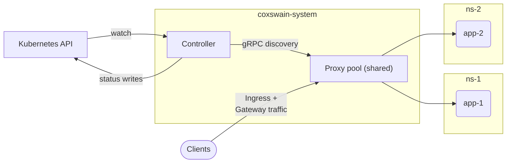
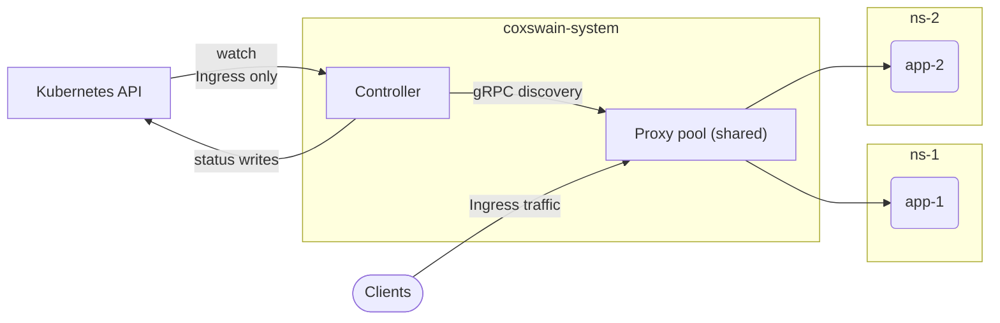
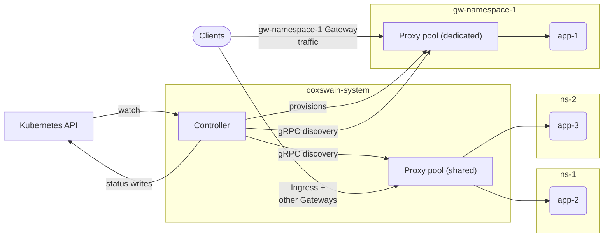
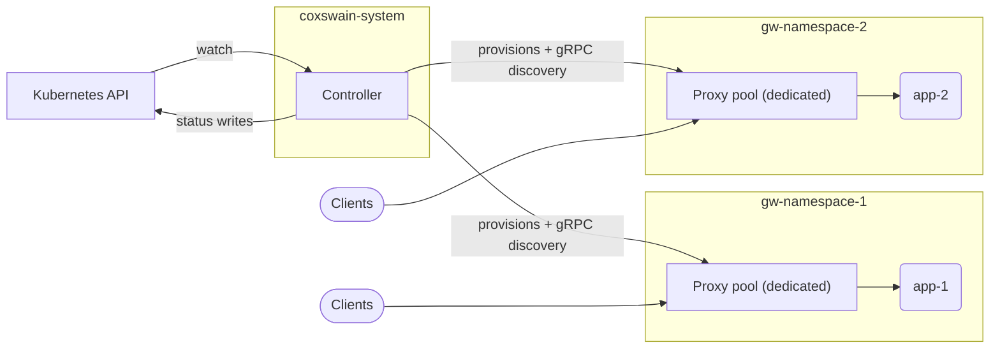

# Proxy topology

Coxswain runs a single controller-managed data plane. **By default every `Ingress` and every `Gateway` is served by one shared proxy pool**; a `Gateway` that requests its own infrastructure (`spec.infrastructure.parametersRef` → `CoxswainGatewayParameters`) instead gets a **dedicated** proxy of its own. This is just how Coxswain implements the Gateway API's per-Gateway infrastructure model — classic `Ingress`, which has no `parametersRef` equivalent, is always shared.

Shared and dedicated are therefore two topologies of the same data plane, not separate install modes: they compose. A production cluster typically runs the shared pool alongside a few dedicated proxies for Gateways that need isolation.

## Scope-aware dispatch

Before the two models: both rely on the controller sending each proxy only the routing slice it needs, not the whole cluster's. The controller maintains two snapshot registries for this:

- **`SharedPool`** — the shared routing cells (Ingress table, Gateway table, TLS store, client-cert store, listener health, plus the TLS-passthrough/terminate and TCP/UDP L4 tables). The shared proxy pool subscribes with this scope and receives a snapshot covering all Ingress and non-dedicated Gateway routing.
- **`Gateway { name, namespace }`** — one entry per opted-in Gateway in the `DedicatedRoutingRegistry`. Each dedicated proxy subscribes with its own Gateway identity and receives only that Gateway's slice. Cross-namespace routes (e.g. `from: All`) are resolved controller-side — the controller's cluster-wide reflector sees every namespace's routes and compiles them into the dedicated snapshot before pushing.

A `Subscribe` message with no scope field is treated as `SharedPool`. A scope message with no kind discriminator is rejected as malformed to prevent a zero-value proto from silently escalating to `SharedPool`.

## Shared

One cluster-wide proxy pool serves every `Ingress` and every `Gateway` that has not opted into dedicated mode. This is the Helm chart default: one controller `Deployment` in `coxswain-system`, which in turn provisions the shared proxy pool.

**The controller owns the shared proxy pool.** The pool's `Deployment`, `ServiceAccount`, internal `Service`, and (optional) `HorizontalPodAutoscaler`/`PodDisruptionBudget` are **controller-provisioned and controller-owned** (SSA field manager `coxswain-controller`), not rendered by Helm — the same ownership model as dedicated proxies and namespace relays. The chart supplies the pool's configuration to the controller as `COXSWAIN_SHARED_PROXY_*` env (remapped from `proxy.shared.*` values) and keeps only the pool's external Ingress `LoadBalancer` `Service`, which selects the pods the controller stamps. Controller ownership is what lets the controller repoint the pool's discovery upstream without fighting Helm's field manager on every `helm upgrade`. Because the pool is provisioned off config rather than off any Gateway, it exists from install with **zero Gateways** — the base data plane. Disabling it (`proxy.shared.enabled=false`) makes the controller reclaim the pool rather than orphan it.

**Shared compute, per-Gateway addressing.** "Shared" describes the proxy *pod* (one set of compute serving everything) — it does not mean Gateways share an address. Each owned `Gateway` still gets its own `Service`/VIP:

- The controller provisions one `Service` per Gateway. That `Service` selects the (single, shared) proxy pod, but maps each of the Gateway's advertised listener ports (e.g. `:443`) to its own distinct internal `targetPort` on that pod.
- The proxy uses the local port a connection arrived on to decide which Gateway's routing/TLS tables apply. That's what keeps two Gateways with overlapping hostnames (both listening on `*.example.com`, say) fully isolated from each other — they're distinguished by port, not just by name.
- Each Gateway still reports its own VIP in `status.addresses`, same as if it had its own dedicated proxy.
- This only relies on standard Kubernetes `Service` `port → targetPort` mapping — no `SO_ORIGINAL_DST`, no conntrack tricks — so it works the same on iptables, IPVS, eBPF, and cloud load balancers alike.

**Per-Gateway infrastructure identity.** The shared pool's actual compute lives in `coxswain-system`, but each Gateway still needs its own "infrastructure identity" per the Gateway API spec — so the controller also provisions a `ServiceAccount` for each owned Gateway, in that Gateway's *own* namespace. This SA is deliberately inert:

- It carries **zero RBAC** — the proxy pod itself runs under a different ServiceAccount entirely. This one exists purely as an identity object.
- Its job is to be the carrier for `spec.infrastructure.{labels,annotations}` (the infrastructure metadata a Gateway can request be applied to its infrastructure) — since in the shared model there's no per-Gateway proxy pod in that namespace for those labels/annotations to land on otherwise.
- It's owner-referenced to the Gateway, so deleting the Gateway garbage-collects it automatically; moving a Gateway into dedicated mode prunes it explicitly instead.
- Infrastructure annotations from this object also propagate onto the Gateway's VIP `Service` — this is how, for example, a cloud load-balancer annotation set on the Gateway reaches the actual `LoadBalancer` Service.

The fixed shared `80`/`443` listeners on the proxy pod are **Ingress-only**: Ingresses legitimately share one address because they merge by host/path and have no per-Ingress isolation. The cost of per-Gateway addressing is **one load-balancer IP per Gateway** in cloud environments — the "one IP for everything" property is intentionally given up; only the proxy compute stays shared. The shared proxy pod selector is supplied by the Helm chart via `--shared-proxy-selector` (the chart knows the release name; the controller cannot derive `app.kubernetes.io/instance` itself); the controller stamps that same label set on the pool's pods and reuses it as the selector of each VIP `Service` and the retained Ingress `LoadBalancer` `Service`, so all three agree.

The VIP `Service` type is set by `proxy.shared.vipServiceType` (default `LoadBalancer`), independent of the shared-proxy `Service` itself. `LoadBalancer` gives each Gateway an external address and works on cloud LBs and MetalLB, which assign a distinct IP per `Service` and route `IP:port` independently. It does **not** work on host-port-binding LBs such as k3s/OrbStack `klipper-lb`, where multiple `LoadBalancer` Services advertising the same port (e.g. `:443`) collide on the host and stay `<pending>` — set `vipServiceType: ClusterIP` there to give each Gateway a stable in-cluster VIP (typically fronted by an external ingress/LB). `NodePort` is rejected: it cannot preserve the advertised listener port.

**Ingress-only (runtime variant):** when Gateway API CRDs are absent at startup, the controller detects their absence, skips Gateway API reconciliation, and the shared proxy pool serves all `Ingress` resources.

## Dedicated (per Gateway)

When a `Gateway` carries a `parametersRef` pointing at a `CoxswainGatewayParameters` object (either on the Gateway directly or inherited from its `GatewayClass`'s `spec.parametersRef`), the controller provisions a dedicated proxy — its own `Deployment`, `Service`, and `ServiceAccount` — in the Gateway's namespace. Traffic for that Gateway is served exclusively by its dedicated proxy pool; the shared proxy pool continues to serve everything else.

A cluster running some dedicated Gateways alongside the shared pool is the typical mixed arrangement:

When every Gateway opts into dedicated mode and the shared proxy pool is scaled to zero (`proxy.shared.replicas: 0`) or disabled (`proxy.shared.enabled: false`), each team's Gateway gets a fully isolated data plane. Classic `Ingress` is unavailable in this arrangement.

See [Dedicated proxy pools](../gateway-api/index.md#dedicated-proxy-pools) for the operator-facing walkthrough — opting a Gateway in, tunable fields, and RBAC.

## Discovery relay tier

The relay tier is **not** part of the proxy topology — it is optional *discovery infrastructure* between the controller and the proxies that scales leader fan-out. It changes nothing about how proxies serve traffic; it only changes where they get their routing snapshots.

**The problem it solves.** Every snapshot stream terminates on the leader controller pod (the discovery `Service` selects the leader), so fan-out, per-stream delta computation, and push bandwidth all scale O(nodes) — shared replicas + dedicated Gateways × replicas — on that one pod. A relay is a zero-RBAC cache pod that subscribes *once* upstream and re-serves the **unchanged** protocol downstream, so the leader sees one stream per relay instead of one per proxy. Leaves run unmodified binaries with unmodified scopes — only their discovery endpoint and expected-server identity differ — and never learn they are behind a relay.

**One controller-owned tier, two scopes** — both provisioned, sized, and torn down by the **controller** off the same `relay.*` knobs; there is no chart-rendered relay:

- **Shared-pool relay** — a single, install-level relay in front of the shared proxy pool. It subscribes `SharedPool` and re-serves it verbatim (a flat passthrough cache). The controller provisions it once the shared pool's replica count crosses the break-even threshold and repoints the pool onto it at runtime.
- **Namespace relay** — a per-namespace relay in front of a namespace's *dedicated* proxies. It subscribes the aggregate `Namespace` scope (every dedicated Gateway's world in that namespace, key-qualified per Gateway), demuxes it back into per-Gateway worlds, and serves each dedicated proxy exactly as the controller would. The controller provisions it (and repoints that namespace's dedicated proxies) once the namespace's dedicated fan-out crosses the threshold.

Enable the whole tier with `relay.enabled` (**on by default — opt-out**; `relay.enabled: false` disables it). The break-even gate keeps each scope inert below threshold, so an install with a small pool and no large dedicated namespaces provisions no relays and is byte-identical to a relay-free one.

**When a relay appears — a control loop.** A relay costs the leader one upstream stream per replica and saves it the downstream streams, so it only *reduces* leader load past a break-even point. The controller re-implements the autoscaler loop internally — it cannot use a Kubernetes HPA, since each relay replica opens the very upstream stream the tier conserves, so a CPU HPA would scale *up* under load and regrow the leader fan-out. The **signal** is the scope's demand: a namespace's live dedicated proxy subscriber count, or the shared pool's replica count.

- **Activation (on/off).** The relay is provisioned once the signal reaches the break-even threshold `relay.minProxyReplicas` (default 8), and torn down after it holds **below** that threshold for the **cooldown** `relay.cooldown` (default 300s). A scope that genuinely drains (no dedicated Gateways left; the pool disabled) is torn down at once; a *transient* drop to 0 live subscribers while demand remains — a relay restart or a control-stream reconnect — waits out the cooldown, so a blip never deletes a live relay.
- **Sizing.** An [autoscaled](../operations/relay-policy.md#autoscaling) relay is sized `clamp(ceil(liveSubscribers / targetProxiesPerReplica), minReplicas, maxReplicas)`, with a relative **tolerance** deadband so small jitter doesn't churn and an asymmetric **scale-down stabilization** window (scale up promptly, scale down only on the trailing-window peak). **`maxReplicas` is mandatory** — it caps the upstream-stream regrowth; keep it well below the scope's downstream fan-out or the relay's own streams approach the count it exists to collapse. The **capacity ratio** `targetProxiesPerReplica` (default 250, measured) is decoupled from the break-even threshold: a relay is a fan-out cache, so real per-replica capacity is O(100s), not the break-even number.

**Make-before-break (a rebalance never disrupts data-plane traffic).** Repointing a proxy between the controller and a relay is a live control-stream reconnect — the proxy swaps its discovery upstream and keeps serving from its last-good routing snapshot; data-plane listeners are never recycled. Because the loop tears relays down at a *nonzero* subscriber count, it sequences explicitly: on **provision** it creates the relay and waits until it is Ready (upstream cache loaded) *before* repointing proxies onto it; on **teardown** it repoints proxies back to the controller *first*, then deletes the relay only once it reports zero downstream subscribers. A proxy is thus never pointed at a not-yet-serving or already-deleted relay.

**Authorization.** The shared relay's `SharedPool` subscribe needs no grant. A namespace relay's `Namespace` subscribe is privileged (it aggregates a whole namespace), so the controller authorizes it **by provenance**: only the relay ServiceAccount it provisioned in that namespace, deny-by-default. A projected token cryptographically binds a pod's SVID to its own namespace, so the worst a forged label can buy is a stream for the tenant's *own* namespace — never a peer's.

**Failure model.** Bootstrap is never tiered — every node, relays included, obtains its SVID straight from the controller, which is also where each node learns its routing-stream upstream. On relay loss a leaf serves its last-good snapshot and reconnects; if the relay is genuinely gone, the leaf re-bootstraps to the controller (the always-up anchor) and is re-pointed at the current upstream — a bounded last-resort handshake, never a routing-snapshot stampede, and the data plane is never disrupted. Relay HA is its replica count.

**Per-namespace tuning.** The break-even loop is the automatic default — no per-namespace action is needed to provision relays where they help. The namespaced [`CoxswainRelayPolicy`](../operations/relay-policy.md) CRD overlays overrides on the per-namespace dedicated relays only: force-on/off, `replicas`, `resources`, `podTemplate` scheduling, and opt-in autoscaling. The shared-pool relay is global — it has no policy and reads the `relay.*` values directly (autoscaling between `relay.replicas` and `relay.maxReplicas`).
