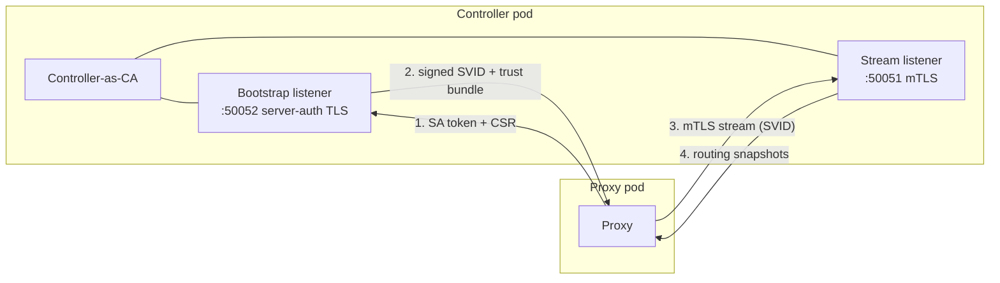

# Control-plane security

Coxswain's data plane (the proxy) never talks to the Kubernetes API. Instead the
**controller** compiles routing snapshots and pushes them to proxies over a gRPC
**discovery** channel. This page explains how that channel is secured: the
controller acts as a certificate authority (CA), a fresh proxy bootstraps its
identity with its Kubernetes ServiceAccount token, and the resulting short-lived
SPIFFE certificate (SVID) authenticates every snapshot stream — with no plaintext
fallback.

## The model



1. **Bootstrap.** A fresh proxy has no certificate. It reads its projected
   ServiceAccount token, generates a keypair locally, and sends the token plus a
   Certificate Signing Request (CSR) to the controller's bootstrap listener over
   server-authenticated TLS (the proxy verifies the controller; it presents no
   client cert — it has none yet).
2. **Issuance.** The controller validates the token with the Kubernetes
   `TokenReview` API (scoped to the `coxswain-discovery` audience), derives the
   proxy's SPIFFE identity (`spiffe://<trust-domain>/ns/<ns>/sa/<sa>`), signs the
   CSR, and returns the SVID plus the public trust bundle. **The proxy's private
   key never leaves the pod, never transits the wire, and never enters controller
   memory.**
3. **Stream.** The proxy opens the mandatory-mTLS stream with its SVID and
   receives routing snapshots. A proxy without a valid CA-signed SVID cannot
   connect — there is no plaintext fallback.
4. **Rotation.** Before the SVID expires the proxy re-bootstraps and reconnects
   with the fresh certificate. Routing never gaps (see
   [SVID rotation](#svid-rotation)).

The trust bundle is a **set** of public CA roots, so CA rotation can trust the
old and new roots during an overlap window.

## CA provisioning modes

The CA lives in a Kubernetes Secret (`type: kubernetes.io/tls` or `Opaque`, keys
`tls.crt` / `tls.key`) in the controller's namespace. How that Secret is created
is the single operator decision, controlled by `discovery.ca.mode`:

### `auto` (default) — self-managed

Nothing to provision. On first start the controller generates a CA and creates
the Secret (race-free across replicas: the first to create wins; the others read
it). It publishes the trust bundle and self-issues its own server certificate.
Zero external tooling.

Inspect the generated CA:

```bash
kubectl -n coxswain-system get secret coxswain-discovery-ca -o yaml
```

### `external` + cert-manager

Set `discovery.ca.mode=external` and let cert-manager author the CA. Coxswain
only **consumes** the resulting Secret and hot-reloads when cert-manager rotates
it — this mirrors how Envoy Gateway and kgateway integrate with cert-manager
(the operator authors the cert; the control plane consumes the Secret). Coxswain
does not render or own the `Certificate`. A copy-pasteable recipe ships at
`deploy/manifests/cert-manager-example.yaml`:

```yaml
apiVersion: cert-manager.io/v1
kind: Certificate
metadata:
  name: coxswain-discovery-ca
  namespace: coxswain-system
spec:
  isCA: true
  commonName: coxswain-discovery-ca
  secretName: coxswain-discovery-ca   # what discovery.ca.secretName points at
  duration: 8760h
  renewBefore: 720h
  issuerRef:
    name: coxswain-discovery-selfsigned
    kind: Issuer
    group: cert-manager.io
```

(The controller programmatically managing `Certificate` CRs itself — the
istio-csr style — is tracked for a later release.)

### `external` + bring-your-own

Set `discovery.ca.mode=external` and supply the Secret yourself:

```bash
kubectl -n coxswain-system create secret tls coxswain-discovery-ca \
  --cert=ca.crt --key=ca.key
```

In `external` mode the controller **fails closed**: if the Secret is absent it
logs an error and does not serve discovery (it never silently self-signs). With
Helm, `external` mode also omits the namespace-scoped secrets-create Role, so the
controller holds no secrets-write grant at all.

## The read-only-proxy invariant

The proxy mounts only **public** material and holds **zero** Kubernetes write
verbs:

- A **projected ServiceAccount token** (audience `coxswain-discovery`,
  auto-rotated by the kubelet) at
  `/var/run/secrets/coxswain/discovery-token/token`.
- The controller-published **trust-bundle ConfigMap** (`coxswain-discovery-trust`,
  public CA roots only) at `/var/run/secrets/coxswain/trust-bundle/ca.crt`.

Both are mounted by the kubelet — the proxy needs no API access to read them. The
proxy never references the CA Secret (which holds the private key). This is the
load-bearing security property of the controller/proxy split: a compromised proxy
cannot write to Kubernetes and cannot read the CA key.

## SVID rotation

SVIDs are short-lived (`discovery.svidTtl`, default `24h`). The proxy refreshes at
~50 % of the TTL: it re-bootstraps, caches the fresh SVID, and signals the stream
supervisor to reconnect. The proxy's routing tables are **never cleared** across a
reconnect — the last-good snapshot keeps serving traffic throughout — so rotation
causes no routing gap and no dropped requests.

The controller's own server certificate is long-lived and refreshed when the
controller pod restarts.

## SVID identity and Gateway scope binding

Every proxy's SVID is derived from its Kubernetes ServiceAccount — the identity
that the `TokenReview` check validates at bootstrap. The table below shows the
canonical form for each deployment model:

| Proxy role | ServiceAccount | SVID |
|---|---|---|
| Shared-pool proxy | `coxswain-shared-proxy` | `spiffe://<trust-domain>/ns/<ns>/sa/coxswain-shared-proxy` |
| Dedicated (per-Gateway) proxy | `<gateway-name>-<gatewayclass-name>` | `spiffe://<trust-domain>/ns/<gateway-ns>/sa/<gateway-name>-<gatewayclass-name>` |

The dedicated proxy SA name follows [GEP-1762](https://gateway-api.sigs.k8s.io/geps/gep-1762/):
it is the same name the controller uses for the provisioned Deployment, Service,
and ServiceAccount. For example, a Gateway `prod/my-gw` of class `coxswain` runs
as SA `my-gw-coxswain` with SVID
`spiffe://<trust-domain>/ns/prod/sa/my-gw-coxswain`.

### Scope binding enforcement

A dedicated proxy subscribes with `Scope::Gateway { name, namespace }` to
receive only its own Gateway's routing snapshot. The stream handler enforces that
the claimed Gateway matches the peer's authenticated SVID:

1. The controller stamps the expected proxy SA (`{gw}-{class}`) into the
   Gateway's dedicated registry entry at reconcile time.
2. When the proxy's `Subscribe` message arrives, the server extracts the URI SANs
   from the peer's TLS client certificate (injected as request metadata by
   `PeerSvidStream`).
3. If the peer's SVID does not match
   `…/ns/<claimed-namespace>/sa/<expected-sa>` the stream is closed immediately
   with `PERMISSION_DENIED` — before any snapshot is delivered.

The trust-domain prefix is validated at the TLS handshake by
`SpiffeClientCertVerifier`, so the binding check only needs to compare the
namespace and ServiceAccount name. A valid cert from the wrong Gateway is still
rejected.

If mTLS is not established (no peer certificate — test or degraded-mode paths
only), the binding check is skipped and the stream is fail-open. In production
there is no plaintext discovery server; `SpiffeClientCertVerifier` mandates
client auth, so every accepted stream carries a peer cert.

## Configuration

See [Configuration reference](../reference/configuration.md#discovery-control-plane)
for the full flag/value list. The common knobs:

| Helm value | Env var | Default | Meaning |
|---|---|---|---|
| `discovery.ca.mode` | `COXSWAIN_DISCOVERY_CA_MODE` | `auto` | `auto` self-generates; `external` consumes a pre-existing Secret (fail closed). |
| `discovery.ca.secretName` | `COXSWAIN_DISCOVERY_CA_SECRET` | `coxswain-discovery-ca` | CA Secret name (controller namespace). |
| `discovery.svidTtl` | `COXSWAIN_DISCOVERY_SVID_TTL` | `24h` | Proxy SVID lifetime; refresh fires at ~50 %. |
| `discovery.trustDomain` | `COXSWAIN_DISCOVERY_TRUST_DOMAIN` | `cluster.local` | SPIFFE trust domain; must match across controller and proxies. |
| `discovery.port` | `COXSWAIN_DISCOVERY_PORT` | `50051` | mTLS Stream listener port. |
| `discovery.bootstrapPort` | `COXSWAIN_DISCOVERY_BOOTSTRAP_PORT` | `50052` | Server-auth bootstrap listener port. |

## Troubleshooting

**Proxy stuck `NotReady`.** The proxy reports `NotReady` until it has bootstrapped
an SVID and received its first snapshot. Check, in order:

- **Trust bundle missing.** `kubectl -n coxswain-system get configmap
  coxswain-discovery-trust` must exist. It is published by the controller on
  startup; if the controller never became ready (e.g. `external` mode with no CA
  Secret), the bundle is never written and proxies cannot verify the controller.
- **Wrong token audience.** The projected token's audience must be
  `coxswain-discovery`. A mismatch is rejected at `TokenReview`.
- **`external` Secret absent.** In `external` mode the controller logs
  `CA Secret absent and mode=external` and does not serve discovery. Supply the
  Secret (cert-manager or `kubectl create secret tls`).

**`BootstrapRejected` events.** When the controller rejects a bootstrap (invalid
or wrong-audience token, malformed CSR), it emits a `BootstrapRejected` Warning
Event in its namespace. The controller is the sole diagnostic emitter — the proxy
never writes events. List them with:

```bash
kubectl -n coxswain-system get events --field-selector reason=BootstrapRejected
```

The event note carries the rejected principal and the reason.
