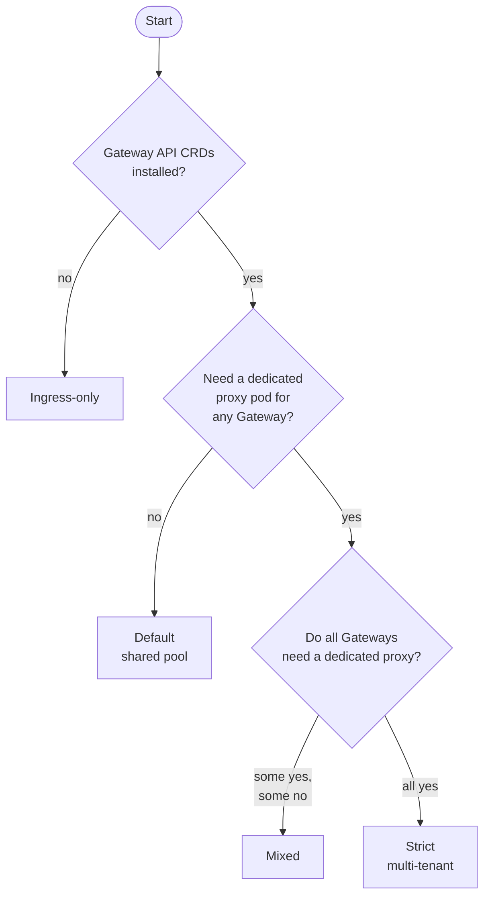
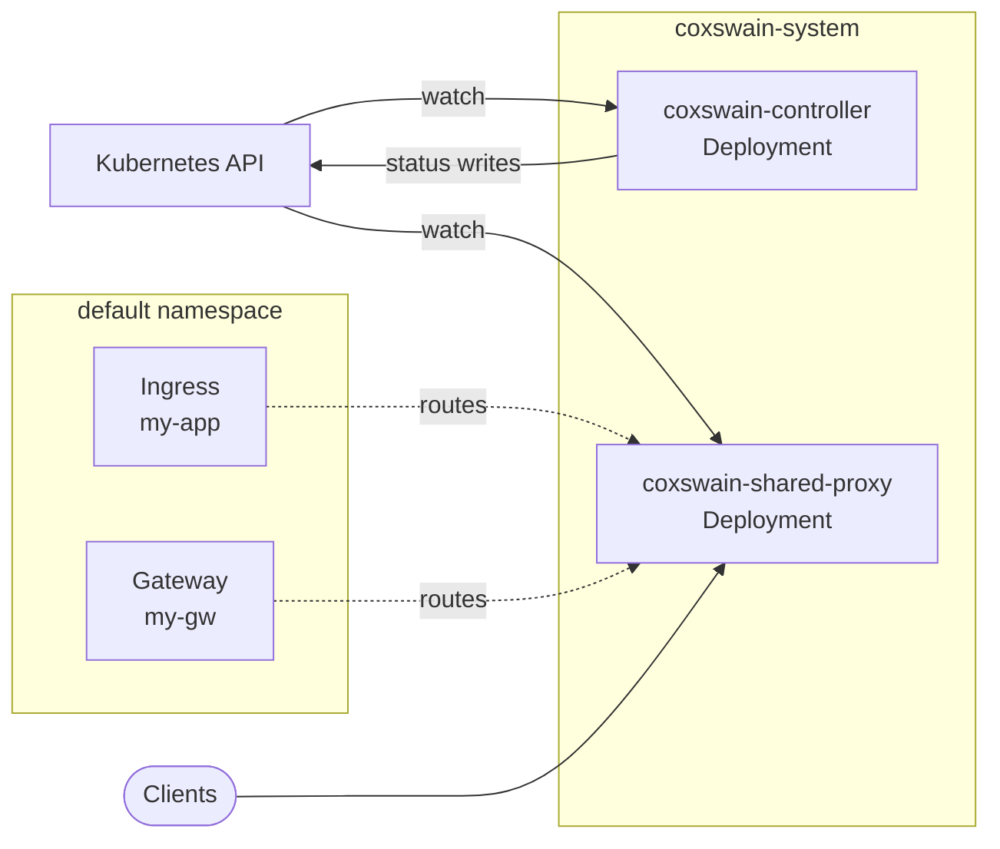
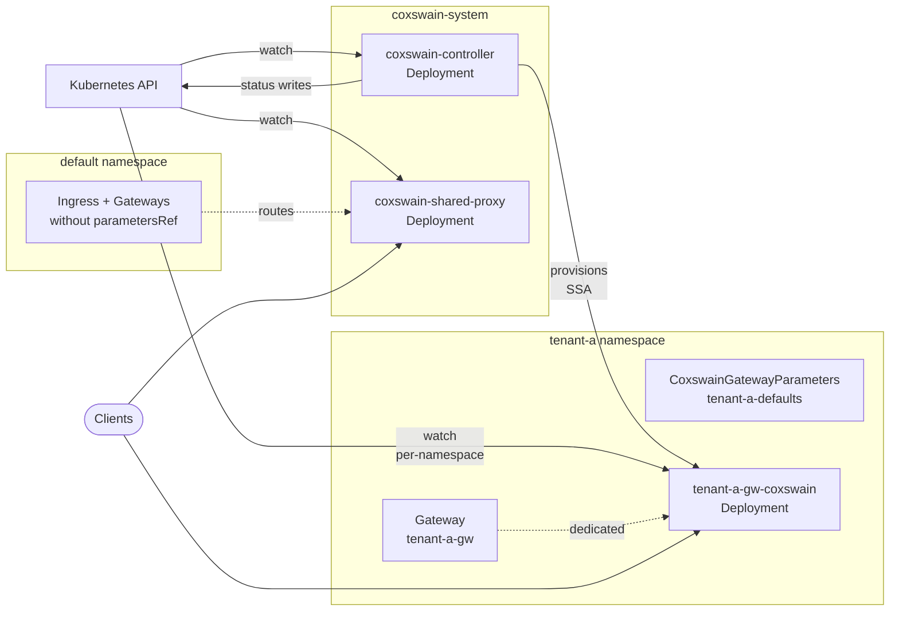
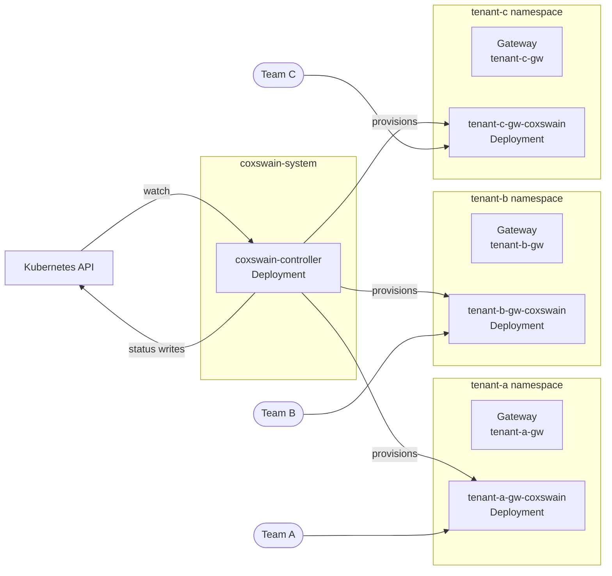
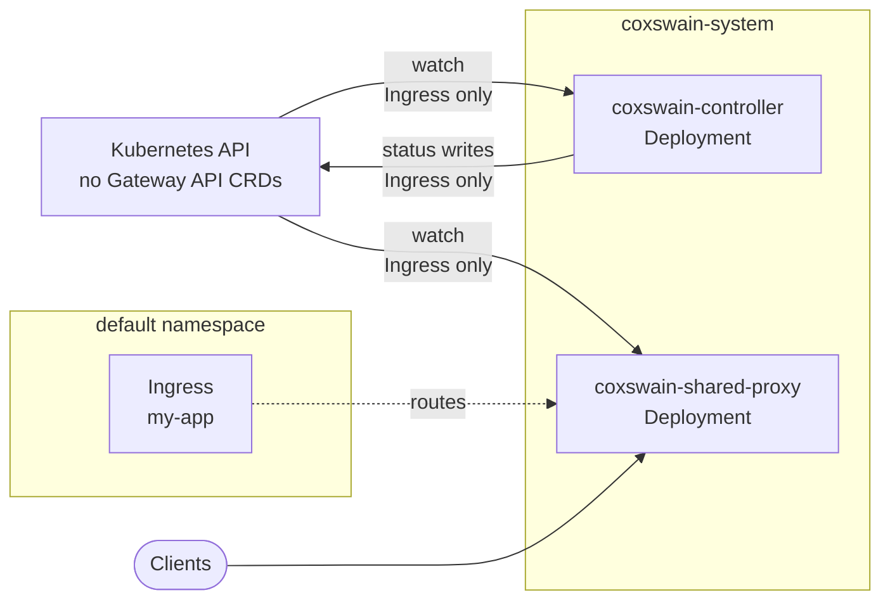

# Deployment models

Coxswain supports four deployment models out of the same Helm chart. The model is a function of three questions — which Kubernetes APIs you serve, how much pod-level isolation you need between Gateways, and whether classic Ingress is in scope at all. This page walks through choosing one and installing it.

For the architectural reference (roles, RBAC matrix, request path), see [Architecture](../architecture.md). For opting an individual Gateway into a dedicated proxy, see the [Dedicated Gateway proxies](gateway-api.md#dedicated-gateway-proxies) section of the Gateway API guide.

## Choosing a model



| Model | Shared pool | Dedicated pods | Ingress | Gateway API |
|---|:-:|:-:|:-:|:-:|
| [Default](#default-shared-pool) | ✓ (≥1 replica) | — | ✓ | ✓ |
| [Mixed](#mixed) | ✓ (≥1 replica) | ✓ (opt-in) | ✓ | ✓ |
| [Strict multi-tenant](#strict-multi-tenant) | — (`replicas: 0`) | ✓ (every Gateway) | — | ✓ |
| [Ingress-only](#ingress-only) | ✓ (≥1 replica) | — | ✓ | — |

All four models run the same controller pod (leader-elected, sole Kubernetes writer). The difference is which data-plane pods exist alongside it.

## Default (shared pool)

The Helm chart default — one controller `Deployment` and one shared proxy `Deployment` in `coxswain-system`. Every `Ingress` and every `Gateway` is served by the shared pool.



### When to choose it

- You have one cluster operator and one (or a few) workload teams.
- Pod-level isolation between Gateways is not a hard requirement.
- You want the simplest install.

### Install

```bash
helm install coxswain charts/coxswain \
  --namespace coxswain-system \
  --create-namespace
```

### Verify

```bash
kubectl -n coxswain-system get pods -l app.kubernetes.io/name=coxswain
# coxswain-controller-...    1/1   Running
# coxswain-shared-proxy-...  1/1   Running

kubectl get gatewayclass coxswain
# NAME       CONTROLLER                             ACCEPTED   AGE
# coxswain   coxswain-labs.dev/gateway-controller   True       30s
```

### Gotchas

- The shared proxy's `ServiceAccount` holds cluster-wide reads. If a workload team must not be able to enumerate other tenants' Secrets, prefer Strict multi-tenant or Mixed (with dedicated proxies for sensitive Gateways).

## Mixed

Default install plus dedicated proxy pods for any `Gateway` that opts in via `spec.infrastructure.parametersRef`. The controller's provisioning operator renders the dedicated proxy's `Deployment` / `Service` / `ServiceAccount` in the Gateway's own namespace.



### When to choose it

- You have one or a few sensitive Gateways (compliance, dedicated SLOs, expensive workload) where pod-level isolation is worth the extra footprint.
- Other traffic — classic `Ingress`, lower-stakes `Gateway`s — happily shares the pool.

### Install

Install with the default chart, then opt individual Gateways into dedicated mode. The full walkthrough lives in [Dedicated Gateway proxies](gateway-api.md#dedicated-gateway-proxies).

```bash
helm install coxswain charts/coxswain \
  --namespace coxswain-system \
  --create-namespace

# Then, per Gateway you want isolated:
kubectl apply -f - <<EOF
apiVersion: gateway.coxswain-labs.dev/v1alpha1
kind: CoxswainGatewayParameters
metadata: { name: tenant-a-defaults, namespace: tenant-a }
spec:
  replicas: 2
  serviceType: ClusterIP
---
apiVersion: gateway.networking.k8s.io/v1
kind: Gateway
metadata: { name: tenant-a-gw, namespace: tenant-a }
spec:
  gatewayClassName: coxswain
  infrastructure:
    parametersRef:
      group: gateway.coxswain-labs.dev
      kind: CoxswainGatewayParameters
      name: tenant-a-defaults
  listeners:
  - { name: http, port: 80, protocol: HTTP, allowedRoutes: { namespaces: { from: Same } } }
EOF
```

### Verify

```bash
# The dedicated proxy lands in the Gateway's namespace, named
# <gateway-name>-coxswain, labelled by the Gateway it serves.
kubectl get all -n tenant-a \
  -l gateway.networking.k8s.io/gateway-name=tenant-a-gw

# Gateway should reach Programmed: True once the proxy is Ready.
kubectl get gateway tenant-a-gw -n tenant-a \
  -o jsonpath='{.status.conditions[?(@.type=="Programmed")].status}'
# True
```

### Gotchas

- **The shared pool still serves dedicated-mode Gateways today.** Exclusion of dedicated Gateways from the shared pool's routing table is tracked in [#210](https://github.com/coxswain-labs/coxswain/issues/210). Until that ships, traffic for a dedicated Gateway lands on *both* its own pod and the shared pool — fine functionally, but the isolation guarantee is not yet absolute.
- The dedicated proxy's `ServiceAccount` is bound to the static `coxswain-gateway-proxy-reader` `ClusterRole` via per-namespace `RoleBinding`s the controller reconciles. The proxy holds reads only in the namespaces its Gateway's HTTPRoutes route a backend into.

## Strict multi-tenant

Every Gateway gets its own proxy pod; the shared proxy `Deployment` runs at `replicas: 0`. Classic `Ingress` is unavailable in this model — `Ingress` has no equivalent of `parametersRef`, so there is nothing to opt it into a dedicated pod.



### When to choose it

- Hard tenant isolation is a requirement — no two teams should share a data-plane process.
- You already mandate Gateway API for ingress traffic; classic `Ingress` is out of scope organisation-wide.
- Failure-domain per tenant matters more than the extra pod footprint.

### Install

```bash
helm install coxswain charts/coxswain \
  --namespace coxswain-system --create-namespace \
  --set proxy.shared.replicas=0
```

The shared proxy `Deployment` is still rendered (so cluster-wide RBAC / Services exist as templates) but runs zero pods. To stop rendering it at all, use `--set proxy.shared.enabled=false`.

Then provision per-tenant Gateways — see [Dedicated Gateway proxies](gateway-api.md#dedicated-gateway-proxies).

### Verify

```bash
kubectl -n coxswain-system get deploy
# coxswain-controller        1/1
# coxswain-shared-proxy      0/0       <-- zero replicas

# Each tenant Gateway has its own proxy in its own namespace.
for ns in tenant-a tenant-b tenant-c; do
  echo "=== $ns"
  kubectl -n "$ns" get deploy -l app.kubernetes.io/managed-by=coxswain-controller
done
```

### Gotchas

- Classic `Ingress` resources have no effect in this model. The controller still reconciles them (in case the cluster operator flips `proxy.shared.replicas` up later), but no pod serves them.
- The dedicated-proxy `ServiceAccount`s collectively hold reads in every namespace a Gateway routes into. The cluster operator is no less powerful — only individual tenant SAs are narrowed.

## Ingress-only

For clusters without Gateway API CRDs. The controller probes for the `GatewayClass` API at startup; if absent, it logs `Gateway API CRDs not found; running in Ingress-only mode` and skips every Gateway API reflector. The shared proxy pool serves all `Ingress` resources.



### When to choose it

- You run on a managed Kubernetes that does not ship Gateway API CRDs, and you cannot install them cluster-wide.
- Your application contract is `Ingress`-only.

### Install

Disable the `GatewayClass` resource (there is no Gateway API to claim a class for) and install:

```bash
helm install coxswain charts/coxswain \
  --namespace coxswain-system --create-namespace \
  --set gatewayClass.create=false
```

If the Gateway API CRDs are later installed cluster-wide, restart the controller pod (`kubectl -n coxswain-system rollout restart deploy/coxswain-controller`) so it re-probes for the CRDs and starts reconciling Gateway API resources.

### Verify

```bash
kubectl -n coxswain-system logs deploy/coxswain-controller | grep 'Ingress-only mode'
# WARN Gateway API CRDs not found; running in Ingress-only mode — restart after installing the CRDs to enable Gateway API

kubectl get gatewayclass 2>&1
# error: the server doesn't have a resource type "gatewayclass"
```

### Gotchas

- The CRD-presence probe runs once at startup. Installing the CRDs later requires a controller pod restart.
- The shared proxy pod's CRD probe is independent of the controller's — both pods log the warning if the CRDs are absent and both need restarting when CRDs land.
