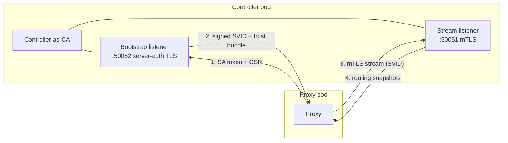

# Control-plane security

Coxswain's data plane (the proxy) never talks to the Kubernetes API. Instead the
**controller** compiles routing snapshots and pushes them to proxies over a gRPC
**discovery** channel. This page explains how that channel is secured: the
controller acts as a certificate authority (CA), a fresh proxy bootstraps its
identity with its Kubernetes ServiceAccount token, and the resulting short-lived
SPIFFE certificate (SVID) authenticates every snapshot stream — with no plaintext
fallback.

## The model



1. **Bootstrap.** A fresh proxy has no certificate. It reads its projected
   ServiceAccount token, generates a keypair locally, and sends the token plus a
   Certificate Signing Request (CSR) to the controller's bootstrap listener over
   server-authenticated TLS (the proxy verifies the controller; it presents no
   client cert — it has none yet).
2. **Issuance.** The controller validates the token with the Kubernetes
   `TokenReview` API (scoped to the `coxswain-discovery` audience), derives the
   proxy's SPIFFE identity (`spiffe://<trust-domain>/ns/<ns>/sa/<sa>`), signs the
   CSR, and returns the SVID plus the public trust bundle. **The proxy's private
   key never leaves the pod, never transits the wire, and never enters controller
   memory.**
3. **Stream.** The proxy opens the mandatory-mTLS stream with its SVID and
   receives routing snapshots. A proxy without a valid CA-signed SVID cannot
   connect — there is no plaintext fallback.
4. **Rotation.** Before the SVID expires the proxy re-bootstraps and reconnects
   with the fresh certificate. Routing never gaps (see
   [SVID rotation](#svid-rotation)).

The trust bundle is a **set** of public CA roots, so CA rotation can trust the
old and new roots during an overlap window.

## CA provisioning modes

The CA lives in a Kubernetes Secret (`type: kubernetes.io/tls` or `Opaque`, keys
`tls.crt` / `tls.key`) in the controller's namespace. How that Secret is created
is the single operator decision, controlled by `discovery.ca.mode`:

### `auto` (default) — self-managed

Nothing to provision. On first start the controller generates a CA and creates
the Secret (race-free across replicas: the first to create wins; the others read
it). It publishes the trust bundle and self-issues its own server certificate.
Zero external tooling.

Inspect the generated CA:

```bash
kubectl -n coxswain-system get secret coxswain-discovery-ca -o yaml
```

### `external` + cert-manager

Set `discovery.ca.mode=external` and let cert-manager author the CA. Coxswain
only **consumes** the resulting Secret and hot-reloads when cert-manager rotates
it — this mirrors how Envoy Gateway and kgateway integrate with cert-manager
(the operator authors the cert; the control plane consumes the Secret). Coxswain
does not render or own the `Certificate`. A copy-pasteable recipe ships at
`deploy/manifests/cert-manager-example.yaml`:

```yaml
apiVersion: cert-manager.io/v1
kind: Certificate
metadata:
  name: coxswain-discovery-ca
  namespace: coxswain-system
spec:
  isCA: true
  commonName: coxswain-discovery-ca
  secretName: coxswain-discovery-ca   # what discovery.ca.secretName points at
  duration: 8760h
  renewBefore: 720h
  issuerRef:
    name: coxswain-discovery-selfsigned
    kind: Issuer
    group: cert-manager.io
```

(The controller programmatically managing `Certificate` CRs itself — the
istio-csr style — is tracked for a later release.)

### `external` + bring-your-own

Set `discovery.ca.mode=external` and supply the Secret yourself:

```bash
kubectl -n coxswain-system create secret tls coxswain-discovery-ca \
  --cert=ca.crt --key=ca.key
```

In `external` mode the controller **fails closed**: if the Secret is absent it
logs an error and does not serve discovery (it never silently self-signs). With
Helm, `external` mode also omits the namespace-scoped secrets-create Role, so the
controller holds no secrets-write grant at all.

## The read-only-proxy invariant

The proxy mounts only **public** material and holds **zero** Kubernetes write
verbs:

- A **projected ServiceAccount token** (audience `coxswain-discovery`,
  auto-rotated by the kubelet) at
  `/var/run/secrets/coxswain/discovery-token/token`.
- The controller-published **trust-bundle ConfigMap** (`coxswain-discovery-trust`,
  public CA roots only) at `/var/run/secrets/coxswain/trust-bundle/ca.crt`.

Both are mounted by the kubelet — the proxy needs no API access to read them. The
proxy never references the CA Secret (which holds the private key). This is the
load-bearing security property of the controller/proxy split: a compromised proxy
cannot write to Kubernetes and cannot read the CA key.

## SVID rotation

SVIDs are short-lived (`discovery.svidTtl`, default `24h`). The proxy refreshes at
~50 % of the TTL: it re-bootstraps, caches the fresh SVID, and signals the stream
supervisor to reconnect. The proxy's routing tables are **never cleared** across a
reconnect — the last-good snapshot keeps serving traffic throughout — so rotation
causes no routing gap and no dropped requests.

The controller's own server certificate is long-lived and refreshed when the
controller pod restarts.

## SVID identity and Gateway scope binding

Every proxy's SVID is derived from its Kubernetes ServiceAccount — the identity
that the `TokenReview` check validates at bootstrap. The table below shows the
canonical form for each proxy role:

| Proxy role | ServiceAccount | SVID |
|---|---|---|
| Shared-pool proxy | `coxswain-shared-proxy` | `spiffe://<trust-domain>/ns/<ns>/sa/coxswain-shared-proxy` |
| Dedicated proxy (per Gateway) | `<gateway-name>-<gatewayclass-name>` | `spiffe://<trust-domain>/ns/<gateway-ns>/sa/<gateway-name>-<gatewayclass-name>` |
| Relay (discovery cache) | `coxswain-relay` (chart) / provisioned per namespace | `spiffe://<trust-domain>/ns/<relay-ns>/sa/<relay-sa>` |

The dedicated proxy SA name follows a fixed pattern:
it is the same name the controller uses for the provisioned Deployment, Service,
and ServiceAccount. For example, a Gateway `prod/my-gw` of class `coxswain` runs
as SA `my-gw-coxswain` with SVID
`spiffe://<trust-domain>/ns/prod/sa/my-gw-coxswain`.

### Scope binding enforcement

A dedicated proxy subscribes for only its own Gateway's routing snapshot, and the discovery server enforces that the claimed Gateway matches the proxy's authenticated SVID. The controller stamps the expected proxy SA (`{gateway}-{class}`) into the Gateway's registry entry at reconcile time; a `Subscribe` whose peer SVID does not match `…/ns/<namespace>/sa/<expected-sa>` is closed with **`PERMISSION_DENIED`** before any snapshot is delivered. A valid certificate from the *wrong* Gateway is still rejected.

The binding check is skipped only when no peer certificate is present — a path that exists solely for tests and degraded modes. Production discovery mandates client auth, so every accepted stream carries a peer cert.

### Relay tier

A [relay](../architecture/discovery-protocol.md#the-relay-tier) is both a discovery **client** (upstream, to the controller) and a discovery **server** (downstream, to proxies). Its ServiceAccount holds **zero Kubernetes verbs** — the same read-only invariant as a proxy — so it never touches the CA Secret, trust bundle, or the controller's `TokenReview`. Downstream it presents its own rotating SVID as its serving certificate and enforces the identical trust-domain and Gateway-scope-binding checks the controller does; it **rejects `Namespace` subscribes** (only the controller serves that scope).

A proxy behind a relay is handed its upstream `(endpoint, expected server SA)` in the bootstrap response, and can be re-pointed live by a `PreferredUpstream` directive on its stream — bootstrap always targets the controller directly, never a relay. Run **≥2 relay replicas** for availability; if a relay becomes unreachable, the proxy **re-bootstraps** to the controller (the always-up anchor) and is re-pointed at the current upstream. This repoints the control stream only — the data plane keeps serving its last-good snapshot throughout, so a relay rebalance never disrupts live traffic.

A relay's `RosterReport` — the upload that folds its downstream leaves into the controller's node registry — is gated on the same identity check as its own subscribe, not on "any connected stream": the namespace relay's report is authorized by the same provenance-plus-identity check as its `Namespace` subscribe, and the shared relay's report requires its SVID to be exactly `(trust domain, install namespace, shared-relay ServiceAccount)`, since it has no per-namespace provenance grant to check against. A report from an unauthorized sender — an ordinary proxy, an unauthenticated connection, or a relay whose namespace just started terminating (its provisioning grant drops ahead of its own pod stopping, so its last in-flight roster can legitimately land here) — is silently dropped, never folded (`coxswain_discovery_roster_reports_total{result="rejected"}`). An authorized relay naming a child outside its own reach — another tenant's Gateway, or the shared pool — is a distinct outcome (`result="partial"`): a well-formed relay can never produce this, so unlike `rejected` it should be flat at zero forever; alert on it. Either way the report is dropped rather than the stream closed: closing would reset the sender's reconnect backoff on every session that already delivered its initial snapshot (which happens before this check can even run), turning a persistently misconfigured or misbehaving identity into a reconnect storm instead of a quiet, observable rejection.

A `node_id` is also unauthenticated — a stream's own choice, not derived from its SVID — so a second connect claiming a live relay's `node_id` is refused rather than silently displacing it; without that guard, any authenticated peer could otherwise reclaim a relay's row and, on its own immediate disconnect, evict the real relay's entire folded subtree without ever sending a `RosterReport`. Refusing the collision only helps if a dead session is eventually noticed, so the discovery server also actively pings idle connections and closes ones that stop answering — otherwise a relay whose old session went half-open (a conntrack eviction, an asymmetric network partition) could never reclaim its own `node_id`.

!!! note "Why the roster rejection path has no hostile-client end-to-end test"

    The happy path is exercised end-to-end: a real relay repoint already proves `RosterReport` folds through this gate on the live path (the dedicated-proxy topology fold, and the shared-relay provisioning suite). The rejection path is unit-tested — including on a real in-process stream, not just the extracted authorization function — but not from an actual hostile client inside a running cluster: doing so needs a pod bootstrapping a non-relay identity and then hand-crafting a `RosterReport`, which is new test infrastructure for one assertion the unit suite already covers.

### The upstream policy

A node never accepts an identity from the network. An upstream pointer — whether it arrives in a bootstrap response or as a live directive — names an endpoint *and* the ServiceAccount whose SPIFFE identity is then trusted there. Deriving the identity from those fields would let whoever sent the pointer choose the server **and** the identity that server must present.

Instead every node resolves the pointer against the three upstreams it can name from its own launch flags:

| Upstream | Host it will accept | Identity it derives |
|---|---|---|
| Controller | `coxswain-controller-discovery.<install-ns>.svc` | `spiffe://<trust-domain>/ns/<install-ns>/sa/coxswain-controller` |
| Its own namespace's relay | `coxswain-relay.<own-ns>.svc` | `spiffe://<trust-domain>/ns/<own-ns>/sa/coxswain-relay` |
| Shared relay | `coxswain-relay-shared.<install-ns>.svc` | `spiffe://<trust-domain>/ns/<install-ns>/sa/coxswain-relay-shared` |

`<install-ns>` is read from the node's own `--discovery-bootstrap-endpoint`, so no extra configuration is involved. A pointer may only **select** one of the three; it cannot define a fourth. The `expected_server_sa` it carries is cross-checked against the locally-derived value and rejected on disagreement, so it never becomes the *source* of the identity.

Two things beyond the host are pinned as part of that identity:

- The **scheme** must be `https`. This is not cosmetic — the gRPC client decides whether to run a TLS handshake at all from the scheme, so an `http://` pointer at an otherwise legal host would stream the node's entire routing world in cleartext with neither side's identity checked.
- The name must end at `.svc` or the default cluster domain. `coxswain-relay.team-a.svc.example.net` satisfies a naive "third label is `svc`" reading while resolving to a name the sender controls.

The **port** is deliberately not pinned. The controller's stream port is a controller-side flag a node never receives, and pinning host plus identity already makes the port irrelevant: whatever answers must present the pinned SVID.

Only the **namespace** relay is scoped to the node's own namespace — a proxy in `team-a` will not accept `coxswain-relay.team-b.svc` even though that is a perfectly well-formed relay host.

Every refusal logs the offending endpoint and increments `coxswain_discovery_client_directives_total{outcome="rejected"}`. **That counter should be flat at zero forever** — a non-zero value means either a naming drift between controller and node versions or a sender attempting to point the node elsewhere, and from the node's side the two are indistinguishable. Alert on it.

What a refusal costs depends on where the node is:

- A node that **already has an upstream** keeps it and keeps serving its last-good routing snapshot. The refusal is a no-op on the data plane.
- A node still **cold** (no upstream yet) has nothing to fall back to — the routing-stream upstream is bootstrap-delivered, so there is no static endpoint. It stays unready with no routing table until it is offered an upstream it can verify.

The second case is deliberate: the alternative is streaming routing configuration from a peer the node could not verify, which is exactly what the policy exists to prevent. A node that cannot establish a trusted upstream stays out of service rather than serving unverified configuration.

!!! note "Why there is no end-to-end test of a refusal"

    Coxswain normally ships an end-to-end test for both the happy and the failing path of every feature. The refusal path here is a deliberate exception, because it cannot be provoked from outside the system.

    A node only ever receives an upstream pointer *from its current upstream*. Injecting a refusable one therefore means first making a hostile server that node's upstream — which is the exact repoint this policy blocks. Standing up an impostor at one of the three legal host names does not help either: it would then need that upstream's SVID, so it fails at the mTLS handshake and exercises a different control entirely. The proxy and relay Deployments are controller-rendered, so their flags cannot be tampered with from outside.

    The resolution logic is a pure function and is covered exhaustively by unit tests, including the scheme, userinfo, extra-label, and foreign-namespace cases. The end-to-end suite instead asserts that a legitimate repoint is *resolved through* the policy — that it is genuinely on the live path — by requiring `outcome="applied"` to be non-zero and `outcome="rejected"` to be zero after a real relay repoint.

### What a compromised relay can and cannot do

A relay is provisioned by the controller, but that governs how it is *created*, not its runtime integrity. Treat relay compromise (a node-level compromise where it is scheduled, or namespace RBAC that permits `pods/exec` on it) as in scope — the same assumed-compromise posture as the read-only-proxy invariant above.

**Cannot:** point its leaves at a discovery server of its choosing. The upstream policy bounds every leaf to the three upstreams above, and reaching any of them requires that upstream's own SVID.

**Cannot:** write to Kubernetes, read the CA private key, or serve a `Namespace` subscribe.

**Can:** serve arbitrary routing content to the leaves it legitimately fronts, and withhold or delay updates to them. Snapshots carry no controller signature independent of the transport, so a leaf verifies *who it is talking to*, not *who authored the configuration*. The reach is the relay's own leaf set:

- A **namespace relay** fronts the dedicated proxies in its namespace — routing for that namespace only.
- The **shared relay** fronts every shared-pool proxy, so its reach is the cluster-wide shared routing world. It runs in the install namespace, where Kubernetes RBAC access is already equivalent to controller access; node-level compromise is what separates the two.

If that residual matters for your threat model, run without the relay tier: proxies then stream directly from the controller and no intermediary sees or forwards configuration. End-to-end payload provenance, which would close it, is not yet implemented.

## Configuration

See [Configuration reference](../reference/configuration.md#discovery-control-plane)
for the full flag/value list. The common knobs:

| Helm value | Env var | Default | Meaning |
|---|---|---|---|
| `discovery.ca.mode` | `COXSWAIN_DISCOVERY_CA_MODE` | `auto` | `auto` self-generates; `external` consumes a pre-existing Secret (fail closed). |
| `discovery.ca.secretName` | `COXSWAIN_DISCOVERY_CA_SECRET` | `coxswain-discovery-ca` | CA Secret name (controller namespace). |
| `discovery.svidTtl` | `COXSWAIN_DISCOVERY_SVID_TTL` | `24h` | Proxy SVID lifetime; refresh fires at ~50 %. |
| `discovery.trustDomain` | `COXSWAIN_DISCOVERY_TRUST_DOMAIN` | `cluster.local` | SPIFFE trust domain; must match across controller and proxies. |
| `discovery.port` | `COXSWAIN_DISCOVERY_PORT` | `50051` | mTLS Stream listener port. |
| `discovery.bootstrapPort` | `COXSWAIN_DISCOVERY_BOOTSTRAP_PORT` | `50052` | Server-auth bootstrap listener port. |

## Reconnect and failure modes

The proxy runs a jittered-exponential-backoff reconnect supervisor (250 ms → 30 s):

| State | `/readyz` | Traffic |
|---|---|---|
| Before first snapshot | `503 NotReady` | — (no routing yet) |
| Disconnect after first snapshot | `200 Degraded` | Served from last-good snapshot |
| Reconnect + new snapshot | `200 Ready` | Updated routing |
| Controller down | `200 Degraded` | Last-good snapshot served indefinitely |

Routing tables are **never cleared** during a reconnect window. A controller outage does not disrupt traffic — proxies keep serving their last compiled snapshot until the controller comes back and pushes a new one.

## Wire-version skew

`WIRE_VERSION = 2` (current — the resource-oriented delta protocol; see [Discovery protocol → wire protocol](../architecture/discovery-protocol.md#the-wire-protocol)). Every `Subscribe` message includes this version. The server rejects a client with a different version immediately with `FAILED_PRECONDITION`; the client backs off **permanently** on that status (it does not retry the stream). Recovery: roll back the mismatched component (controller or proxy) to a matching version. There is no runtime negotiation — both ends must agree, and the break from `1` is hard (no back-compat: v1 sent a whole-table snapshot on every change, v2 streams per-resource deltas).

## Troubleshooting

**Proxy stuck `NotReady`.** The proxy reports `NotReady` until it has bootstrapped
an SVID and received its first snapshot. Check, in order:

- **Trust bundle missing.** `kubectl -n coxswain-system get configmap
  coxswain-discovery-trust` must exist. It is published by the controller on
  startup; if the controller never became ready (e.g. `external` mode with no CA
  Secret), the bundle is never written and proxies cannot verify the controller.
- **Wrong token audience.** The projected token's audience must be
  `coxswain-discovery`. A mismatch is rejected at `TokenReview`.
- **`external` Secret absent.** In `external` mode the controller logs
  `CA Secret absent and mode=external` and does not serve discovery. Supply the
  Secret (cert-manager or `kubectl create secret tls`).
- **Wrong `--discovery-bootstrap-endpoint`.** This is the proxy's sole endpoint
  anchor: if it cannot reach the controller's bootstrap listener it never obtains
  an SVID (nor learns its routing upstream) and stays NotReady. Verify the URI and
  that the discovery bootstrap `Service` exists in the controller namespace.

**Proxy `Degraded` after restart.** Normal — the proxy starts `NotReady` until it reconnects and receives its first snapshot from the new controller. If it stays `Degraded` indefinitely, check connectivity to the discovery endpoint.

**Wire-version mismatch.** The proxy logs `FAILED_PRECONDITION` and backs off permanently. Check that the controller and proxy images are from the same release. See [Wire-version skew](#wire-version-skew).

**`BootstrapRejected` events.** When the controller rejects a bootstrap (invalid
or wrong-audience token, malformed CSR), it emits a `BootstrapRejected` Warning
Event in its namespace. The controller is the sole diagnostic emitter — the proxy
never writes events. List them with:

```bash
kubectl -n coxswain-system get events --field-selector reason=BootstrapRejected
```

The event note carries the rejected principal and the reason.
